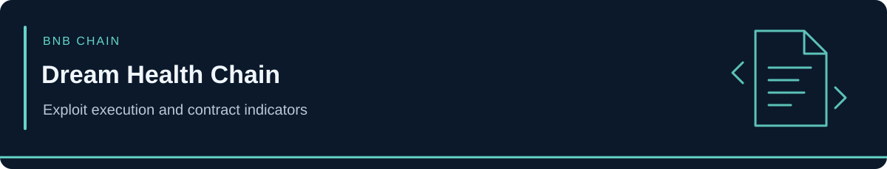

<!-- case-visual:start -->

  

<!-- case-visual:end -->

<!-- doc-nav:start -->

<a href="../../../readme.md">Home</a> · <a href="../../../wallets.md">Wallet index</a> · <a href="../../../CATALOG.md">All case files</a> · <a href="../../README.md">Parent index</a>

<!-- doc-nav:end -->

# Dream Health Chain Exploit

| Field | Assessment |
|---|---|
| Incident date | September 5, 2026 |
| Network | BNB Smart Chain |
| Classification | Business-award state-machine logic exploit |
| Reported loss | Approximately $71,800 |
| Confidence | High security-firm address and incident linkage |
| Priority | P3 cross-chain intelligence |

<!-- contents:start -->

Contents

<ul>
<li><a href="#section-executive-assessment">Executive Assessment</a></li>
<li><a href="#section-direct-indicators">Direct Indicators</a></li>
<li><a href="#section-monitoring-priorities">Monitoring Priorities</a></li>
<li><a href="#section-attribution-boundaries">Attribution Boundaries</a></li>
<li><a href="#section-sources">Sources</a></li>
<li><a href="#section-tldr">TLDR</a></li>
</ul>

<!-- contents:end -->

## Executive Assessment

SlowMist published a complete attacker wallet and exploit contract for the Dream Health Chain incident. Its analysis attributes the loss to a business-award state-machine flaw that allowed the reward path to be abused without the intended collateral and claim-state protections.

The complete identifiers are retained because they are directly useful for defensive monitoring. The smaller impact and non-primary network place the case at P3 rather than the repository's P1 alert tier.

## Direct Indicators

| Address | Type | Role | Confidence | Treatment |
|---|---|---|---|---|
| [`0xd3a8d0a9f55cf679fff6f277e49afc95b49d2b07`](https://bscscan.com/address/0xd3a8d0a9f55cf679fff6f277e49afc95b49d2b07) | Wallet | Attacker and proceeds address | High | P3 direct watch |
| [`0x226923d34a10f3d54b57b9f4b685e82c6cba968a`](https://bscscan.com/address/0x226923d34a10f3d54b57b9f4b685e82c6cba968a) | Contract | Attacker-controlled exploit contract | High | P3 malicious infrastructure and graph pivot |

## Monitoring Priorities

1. Watch the attacker wallet for consolidation, swaps, bridge activity, and exchange deposits.
2. Review the exploit contract's deployer, funding, calls, and reused bytecode.
3. Retain project contracts and award participants as victim or transaction context unless separately attributed.

## Attribution Boundaries

- SlowMist identifies the wallet and exploit contract, but no real-world person or named threat group is established.
- The P3 designation reflects impact and repository prioritization, not weaker address linkage.
- Dream Health Chain protocol contracts, affected users, liquidity venues, and ordinary counterparties must not inherit the attacker label.

## Sources

- [SlowMist — Dream Health Chain incident alert, identifiers, loss, and root cause](https://x.com/SlowMist_Team/status/2096152539767120259)
- [BscScan — attacker wallet](https://bscscan.com/address/0xd3a8d0a9f55cf679fff6f277e49afc95b49d2b07)
- [BscScan — exploit contract](https://bscscan.com/address/0x226923d34a10f3d54b57b9f4b685e82c6cba968a)

---

## TLDR

Dream Health Chain lost approximately $71,800 in a business-award state-machine exploit. The published attacker wallet and exploit contract are high-confidence P3 cross-chain indicators; victim and protocol infrastructure remain excluded.
