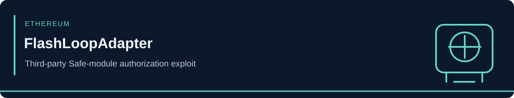

<!-- case-visual:start -->

  

<!-- case-visual:end -->

<!-- doc-nav:start -->

<a href="../../../readme.md">Home</a> · <a href="../../../wallets.md">Wallet index</a> · <a href="../../../CATALOG.md">All case files</a> · <a href="../../README.md">Parent index</a>

<!-- doc-nav:end -->

# FlashLoopAdapter Safe-Module Exploit

| Field | Assessment |
|---|---|
| Incident date | October 1, 2026 |
| Disclosure | October 2, 2026 |
| Network | Ethereum |
| Classification | Third-party Safe-module authorization bypass using a fake Safe |
| Reported proceeds | Approximately 114.09 ETH / $305,000 |
| Confidence | High incident and attacker-address attribution |

<!-- contents:start -->

Contents

<ul>
<li><a href="#section-executive-assessment">Executive Assessment</a></li>
<li><a href="#section-direct-threat-seed">Direct Threat Seed</a></li>
<li><a href="#section-exploit-mechanics">Exploit Mechanics</a></li>
<li><a href="#section-infrastructure-and-victims--do-not-threat-label">Infrastructure and Victims — Do Not Threat-Label</a></li>
<li><a href="#section-monitoring-priorities">Monitoring Priorities</a></li>
<li><a href="#section-sources">Sources</a></li>
<li><a href="#section-tldr">TLDR</a></li>
</ul>

<!-- contents:end -->

## Executive Assessment

The attacker abused an access-control weakness in FlashLoopAdapter, a third-party Safe module used for leveraged positions built on Aave V3. The adapter trusted a caller-controlled response to an authorization check, allowing a malicious fake Safe to report that FlashLoopAdapter was enabled.

After obtaining a Morpho flash loan, the attacker repaid roughly 1,300 WETH of debt and extracted collateral from two victim Safes, retaining approximately 114.09 ETH. This was not an Aave V3 core-protocol compromise.

## Direct Threat Seed

| Network | Address | Role | Confidence | Treatment |
|---|---|---|---|---|
| Ethereum | [`0x42c2633438609881c8fBAb82414eb9A0c45F9353`](https://etherscan.io/address/0x42c2633438609881c8fBAb82414eb9A0c45F9353) | Attacker EOA / exploit seed | High | P1 direct watch and graph expansion |

## Exploit Mechanics

1. The attacker supplied a fake Safe under their control.
2. The adapter accepted the fake Safe's response to its authorization query.
3. Attacker-controlled routing and call data reached privileged adapter functionality.
4. Flash liquidity repaid victim debt so collateral could be extracted.
5. The loan was repaid and approximately 114.09 ETH remained with the attacker.

## Infrastructure and Victims — Do Not Threat-Label

| Address | Role | Handling |
|---|---|---|
| [`0x16bb8b912da187870c23ec6756bb3fad061283d8`](https://etherscan.io/address/0x16bb8b912da187870c23ec6756bb3fad061283d8) | Vulnerable FlashLoopAdapter contract | Code and exposure analysis only |
| [`0xe3b23e47df7cd85876ac6cb05bdb9d7cd5b28520`](https://etherscan.io/address/0xe3b23e47df7cd85876ac6cb05bdb9d7cd5b28520) | Affected victim Safe | Exploit-flow reconstruction only |
| [`0xcfedf95a3653a128dfc2e4288758a1a1850d169f`](https://etherscan.io/address/0xcfedf95a3653a128dfc2e4288758a1a1850d169f) | Affected victim Safe | Exploit-flow reconstruction only |

Aave V3, Morpho, Safe core contracts, routers, and ordinary counterparties do not inherit the attacker label from their role in the transaction path.

## Monitoring Priorities

1. Watch the attacker EOA for proceeds movement, CEX deposits, bridges, mixers, and reuse.
2. Backward-trace initial funding and contract preparation with role-specific confidence.
3. Identify other Safes that enabled the vulnerable adapter without classifying them as malicious.
4. Track remediation separately from attacker activity.

## Sources

- [SlowMist Hacked — incident registry](https://hacked.slowmist.io/)
- [Crypto.news — FlashLoopAdapter transaction and root-cause reconstruction](https://crypto.news/flashloopadapter-exploit-drains-305k-from-aave-linked-safe-wallets/)
- [Machine-readable indicators](./addresses.csv)

---

## TLDR

`0x42c2...9353` is the High-confidence attacker seed. FlashLoopAdapter was the vulnerable third-party Safe module; the two Safes were victims, and Aave V3 core was not compromised.
