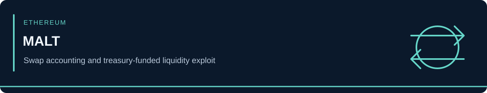

<!-- case-visual:start -->

  

<!-- case-visual:end -->

<!-- doc-nav:start -->

<a href="../../../readme.md">Home</a> · <a href="../../../wallets.md">Wallet index</a> · <a href="../../../CATALOG.md">All case files</a> · <a href="../../README.md">Parent index</a>

<!-- doc-nav:end -->

# MALT Swap-Function Exploit

| Field | Assessment |
|---|---|
| Incident disclosure | October 3, 2026 |
| Network | Ethereum / EVM |
| Classification | Swap accounting flaw involving an external rebalance hook |
| Reported loss | Approximately $72,000 |
| Confidence | High attacker-address and root-cause attribution from SlowMist |

<!-- contents:start -->

Contents

<ul>
<li><a href="#section-executive-assessment">Executive Assessment</a></li>
<li><a href="#section-direct-threat-seed">Direct Threat Seed</a></li>
<li><a href="#section-exploit-mechanics">Exploit Mechanics</a></li>
<li><a href="#section-explicit-exclusions">Explicit Exclusions</a></li>
<li><a href="#section-monitoring-priorities">Monitoring Priorities</a></li>
<li><a href="#section-sources">Sources</a></li>
<li><a href="#section-tldr">TLDR</a></li>
</ul>

<!-- contents:end -->

## Executive Assessment

SlowMist attributes the MALT incident to an unsafe interaction between `swap(uint256,uint256,address)`, the pool's pre-swap reserve snapshot, and an external `rebalanceHook`. The hook withdrew DAI from MALT's Capital Source and deposited it into the pool before the invariant check completed. The check then treated protocol-funded DAI as caller-supplied input, allowing negligible attacker input to unlock disproportionate MALT output.

This is an application-level accounting and call-order defect. No named person or threat group is attributed, and no CVE was assigned in the reviewed disclosure.

## Direct Threat Seed

| Network | Address | Role | Confidence | Treatment |
|---|---|---|---|---|
| Ethereum | [`0x8F103B6A0aD705bcE6357842A5fefEB49e8D83Ef`](https://etherscan.io/address/0x8F103B6A0aD705bcE6357842A5fefEB49e8D83Ef) | Attacker / exploit seed | High | P1 direct watch and graph expansion |

Use the address for backward funding analysis and forward proceeds monitoring. Counterparties do not inherit its label without separate evidence.

## Exploit Mechanics

1. The swap function recorded the caller input and pre-swap pool reserves.
2. It called an external rebalance hook before finalizing its accounting.
3. The hook sourced DAI from MALT's Capital Source and deposited it into the pool.
4. The invariant check counted that treasury-funded DAI as though the caller had supplied it.
5. The attacker withdrew disproportionate MALT with negligible economic input.

## Explicit Exclusions

| Address | Role | Handling |
|---|---|---|
| [`0xF0d314849A3Bc9270a79110F25dBA2c8325A2AAC`](https://etherscan.io/address/0xF0d314849A3Bc9270a79110F25dBA2c8325A2AAC) | Victim address | Exploit-flow reconstruction only; do not threat-label |
| [`0xfe6C096a2871337d4f6F7DD04Ebda733E94D7A13`](https://etherscan.io/address/0xfe6C096a2871337d4f6F7DD04Ebda733E94D7A13) | Vulnerable MALT contract | Code, call-path, exposure, and remediation analysis only |

## Monitoring Priorities

1. Watch the attacker seed for swaps, bridges, mixers, exchange deposits, and reuse.
2. Trace the address's historical funding without automatically labeling upstream services or counterparties.
3. Monitor the vulnerable contract for remediation and any repeat call pattern.
4. Keep recovery and victim activity distinct from attacker proceeds.

## Sources

- [SlowMist — MALT alert, full identifiers, and root-cause summary](https://x.com/SlowMist_Team/status/2106418632041668784)
- [KuCoin mirror of the SlowMist alert](https://www.kucoin.com/id/news/insight/DAI/6ac14c3d38a2640007926b0c)
- [Machine-readable indicators](./addresses.csv)

---

## TLDR

`0x8F10...83Ef` is the High-confidence attacker seed. The victim address and vulnerable MALT contract are retained as non-attacker context. The flaw counted treasury-funded liquidity introduced by an external hook as if it were attacker input.
