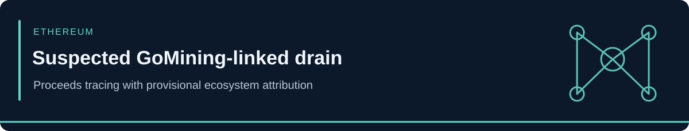

<!-- case-visual:start -->

  

<!-- case-visual:end -->

<!-- doc-nav:start -->

<a href="../../../readme.md">Home</a> · <a href="../../../wallets.md">Wallet index</a> · <a href="../../../CATALOG.md">All case files</a> · <a href="../../README.md">Parent index</a>

<!-- doc-nav:end -->

# Suspected GoMining-Linked Multi-Wallet Drain

| Field | Assessment |
|---|---|
| Incident window | September 4-5, 2026 |
| Network path | Multiple networks to Ethereum consolidation |
| Classification | Coordinated multi-wallet drain and cross-chain proceeds consolidation |
| Reported scope | More than 600 drained wallets |
| Reported proceeds | Approximately 1,147 ETH / $2.8 million |
| Confidence | High for the consolidation flow; medium for GoMining ecosystem attribution |

<!-- contents:start -->

Contents

<ul>
<li><a href="#section-executive-assessment">Executive Assessment</a></li>
<li><a href="#section-direct-incident-watch-seed">Direct Incident-Watch Seed</a></li>
<li><a href="#section-monitoring-priorities">Monitoring Priorities</a></li>
<li><a href="#section-attribution-boundaries">Attribution Boundaries</a></li>
<li><a href="#section-sources">Sources</a></li>
<li><a href="#section-tldr">TLDR</a></li>
</ul>

<!-- contents:end -->

## Executive Assessment

Specter reported a coordinated drain affecting more than 600 wallets, followed by swaps and cross-chain movements that consolidated approximately 1,147 ETH at one Ethereum address. Several affected wallets were described as GoMining-tagged or as having prior GMT exposure, leading to a suspected GoMining ecosystem association.

The proceeds address is actionable for direct monitoring. The wider GoMining attribution remains provisional because GoMining had not publicly confirmed that the full wallet population belonged to its ecosystem at the reporting cutoff. The case name and address role intentionally preserve that distinction.

## Direct Incident-Watch Seed

| Network | Address | Role | Flow confidence | Ecosystem-attribution confidence | Treatment |
|---|---|---|---|---|---|
| Ethereum | [`0xa7372Fa49da5e52cf31f35cCE517C4768FeD4704`](https://etherscan.io/address/0xa7372Fa49da5e52cf31f35cCE517C4768FeD4704) | Stolen-fund consolidation address receiving approximately 1,147 ETH | High | Medium | P2 direct watch and cautious graph expansion |

## Monitoring Priorities

1. Alert on outbound ETH, token swaps, bridges, mixers, and centralized-exchange deposits.
2. Preserve source-chain transaction paths and distinguish direct victim outflows from routers, bridges, and settlement addresses.
3. Search for earlier campaigns using the same funding, deployment, consolidation, or cash-out infrastructure.
4. Upgrade the GoMining label only if the project, investigators, service providers, or transaction-level control evidence confirms it.

## Attribution Boundaries

- The consolidation wallet is strongly linked to the coordinated drain's proceeds flow.
- The label `suspected GoMining-linked` is an investigative association, not a confirmed GoMining compromise or attacker ownership statement.
- Prior GMT holdings and third-party service tags do not prove every affected wallet belonged to GoMining.
- Bridges, routers, DEXs, exchanges, tagged service wallets, and ordinary counterparties remain infrastructure or victim pivots unless separately attributed.
- No named person or threat group is established.

## Sources

- [Specter Investigation — coordinated drain and consolidation tracing](https://t.me/specterinvestigation)
- [ChainBounty — reproduced consolidation address and attribution caveat](https://x.com/ChainBountyX)
- [CoinGabbar — reported wallet scope, value, and proceeds address](https://www.coingabbar.com/en/crypto-currency-news/crypto-hack-news-gomining-wallet-attack-gmt-eth-stolen)
- [Etherscan — consolidation address](https://etherscan.io/address/0xa7372Fa49da5e52cf31f35cCE517C4768FeD4704)

---

## TLDR

Approximately 1,147 ETH from a coordinated drain was reportedly consolidated at `0xa737...D4704`. The address is a P2 proceeds seed. The reported connection to the GoMining ecosystem remains medium-confidence and must not be converted into a definitive `GoMining attacker` label.
