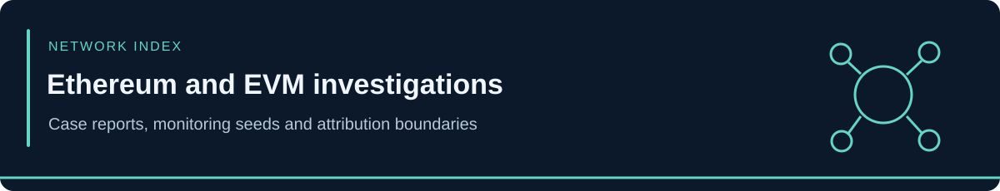

<!-- case-visual:start -->

  

<!-- case-visual:end -->

<!-- doc-nav:start -->

<a href="../readme.md">Home</a> · <a href="../wallets.md">Wallet index</a> · <a href="../CATALOG.md">All case files</a>

<!-- doc-nav:end -->

# Ethereum and EVM Case Index

<!-- contents:start -->

Contents

<ul>
<li><a href="#section-case-directories">Case Directories</a></li>
<li><a href="#section-cross-chain-cases">Cross-Chain Cases</a></li>
<li><a href="#section-monitoring-scope">Monitoring Scope</a></li>
</ul>

<!-- contents:end -->

## Case Directories

| Network | Case |
|---|---|
| Arbitrum | [AFX-Bridge](./Arbitrum/AFX-Bridge/) |
| Arbitrum | [Ostium](./Arbitrum/Ostium/) |
| BNB-Chain | [Dream-Health-Chain](./BNB-Chain/Dream-Health-Chain/) |
| Ethereum | [Etherfi-AtomicQueue](./Ethereum/Etherfi-AtomicQueue/) |
| Ethereum | [FlashLoopAdapter](./Ethereum/FlashLoopAdapter/) |
| Ethereum | [KREMLIN-REF9334](./Ethereum/KREMLIN-REF9334/) |
| Ethereum | [MALT](./Ethereum/MALT/) |
| Ethereum | [RedSonic](./Ethereum/RedSonic/) |
| Ethereum | [Safe-rsETH-Module](./Ethereum/Safe-rsETH-Module/) |
| Ethereum | [Suspected-GoMining-Drain](./Ethereum/Suspected-GoMining-Drain/) |
| Ethereum | [Zunami-Protocol](./Ethereum/Zunami-Protocol/) |

## Cross-Chain Cases

See the [multi-chain index](../Multi-Chain/) for Bitget, FomoPeek, Nesa, ICON, Fetch/NuNet/SingularityNET, bridges, sanctions, and cases with Ethereum proceeds. These retain their canonical reports outside this directory.

## Monitoring Scope

Use each case's chain identifier, role, confidence, and attribution limits. An identical hexadecimal address on two EVM networks does not establish that all activity or balances are shared.
