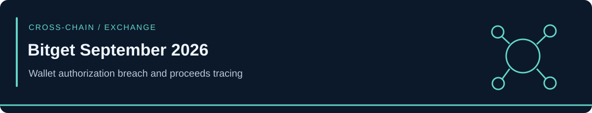

<!-- case-visual:start -->

  

<!-- case-visual:end -->

<!-- doc-nav:start -->

<a href="../../readme.md">Home</a> · <a href="../../wallets.md">Wallet index</a> · <a href="../../CATALOG.md">All case files</a> · <a href="../README.md">Parent index</a>

<!-- doc-nav:end -->

# Bitget September 2026 — Wallet Backend Breach

**Evidence cutoff:** September 25, 2026, except the September 26 independent caution on the third address. Figures describe source snapshots, not current balances.

| Field | Assessment |
|---|---|
| Detection | September 24, 2026, 18:31 UTC |
| Confirmed affected layers | Portions of Bitget hot and warm wallets; cold wallets unaffected per Bitget |
| Reported loss | Approximately $351.6 million across the incident, **not** the amount deposited in one monitored wallet |
| Attack mechanism | Bitget reports backend access and manipulated transaction data accepted by its authorization/signing process; precise initial access remains undisclosed |
| Networks | Ethereum, XRP Ledger, Arbitrum, Avalanche, Optimism, BNB Chain, Base; later routes also enter TRON and Bitcoin |
| Actor | “Bitget Exploiter September 2026”; **suspected** DPRK / TraderTraitor connection, Medium confidence, no formal attribution |
| Address evidence | Two TRM-identified Ethereum wallets; one Bubblemaps-reported downstream pivot with disputed direct-path verification |

[Bitget's official notice](https://www.bitget.com/support/articles/12560603896024) confirms unauthorized transfers and the aggregate estimate. [TRM Labs' September 25 investigation](https://www.trmlabs.com/resources/blog/bitget-loses-usd-3516-million-in-hot-wallet-breach-in-likely-north-korea-attack) traces the cross-chain flows and attributes the backend authorization account to Bitget's CEO. A completed technical postmortem on the initial access path was not yet public at the cutoff. Bitget says the private keys were not stolen. An early EVM-only estimate of $170–190 million omitted about $158 million in XRP and roughly $7 million in TRX; these are **components and changing snapshots**, not separate losses to add onto $351.6 million.

<!-- contents:start -->

Contents

<ul>
<li><a href="#section-complete-monitoring-addresses">Complete monitoring addresses</a></li>
<li><a href="#section-laundering-and-attribution-boundaries">Laundering and attribution boundaries</a></li>
</ul>

<!-- contents:end -->

## Complete monitoring addresses

| Network | Address | Role | Confidence and treatment |
|---|---|---|---|
| Ethereum; also same identifier on several EVM networks | `0x770b10b273fC44Fe9197D6bF20F145c2e98463Ee` | Primary attacker collection/consolidation | High incident linkage; **P1 direct watch**, cross-chain graph expansion |
| Ethereum | `0xa6dd3f218b65e32ccc37be30f74884133c655545` | Major proceeds distribution/hub | High incident linkage per TRM; **P1 direct watch**; do not attribute all historical hub volume to this breach |
| Ethereum / EVM | `0x469Ac1406dE92f82C0563477240a3627057425DC` | Reported onward dispersal destination | **Medium for direct path**, unknown control; **P2 incident-flow watch/pivot**, no attacker-ownership label |

TRM reports the first wallet received value on Ethereum, Arbitrum, Avalanche, Base, BNB Chain, and Optimism. The second sent funds to fresh wallets over roughly two hours; many received about 10,000 ETH and eight wallets received most of the stolen ETH in TRM's snapshot. Its public report does not disclose the complete eight-wallet set, so this case does not reconstruct it. A [September 26 independent reconstruction](https://community.chainbounty.io/posts/01a0dd61-0077-745e-b37a-6294089adf97) confirms an incident-linked Ethereum inflow to the hub but cautions that not all much larger gross hub outflows are incident-attributable. It also could not independently confirm the direct edge between the first and third addresses; [Bubblemaps' contemporaneous alert](https://x.com/bubblemaps/status/2103229553850380794) supplies that reported edge. The third address remains a monitored lead, with that limitation visible in [addresses.csv](./addresses.csv).

## Laundering and attribution boundaries

TRM traces smaller portions through THORChain toward Bitcoin peel chains and through Across, Bridgers, Chainflip, and FixedFloat. Complete public BTC and XRP Ledger destination identifiers are absent from its report, so none are guessed or ingested here. Routers, bridges, DEX settlement endpoints, and ordinary counterparties **do not inherit attacker labels**. An EVM hex address is network-agnostic syntax; monitoring its Ethereum row alone does not capture transactions on the five other EVM chains TRM names.

TRM found laundering overlap with previously identified North Korean thefts, including Bybit and AFX Bridge. It assesses that the laundering network used here was also used by TraderTraitor in other recent thefts but explicitly **does not definitively attribute this Bitget theft to DPRK**. Shared infrastructure is evidence for a Medium-confidence hypothesis, not proof that every wallet controller is the same operator. No reported evidence in this case supports classifying the breach as a direct private-key theft.

The initial Duelbits lead exposed only a truncated identifier at that cutoff. The [September 28 Duelbits update](../Duelbits-September-2026/) now retains a complete CertiK-published Solana seed; keep that separate incident outside the Bitget cluster. At the evidence cutoff, complete new BTC/XRP destinations and an authoritative root-cause postmortem were outstanding.
