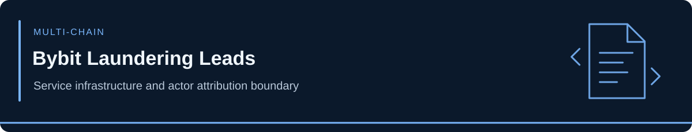

<!-- case-visual:start -->

  

<!-- case-visual:end -->

<!-- doc-nav:start -->

<a href="../../readme.md">Home</a> · <a href="../../wallets.md">Wallet index</a> · <a href="../../CATALOG.md">All case files</a> · <a href="../README.md">Parent index</a>

<!-- doc-nav:end -->

# Bybit Theft — October 2026 Laundering-Network Leads

**Disclosure:** October 5, 2026. [ZachXBT's undercover investigation](https://x.com/zachxbt/status/2107081638073319437) obtained transaction instructions from a Chinese-language laundering contact and matched the supplied identifiers, timing and cross-chain movements against public transactions. The FBI attributed the original February 2025 Bybit theft to DPRK TraderTraitor; **that attribution does not establish DPRK ownership of every laundering-service address**. The contact's real-world identity and the broader claimed $1 billion network volume are not independently established.

| Network | Complete identifier | Supported role |
|---|---|---|
| Solana | `9gSwa2Mew9P21Wxs8nFgDujTurKZx1nBEVRv6K5sJP6e` | Operator-provided laundering destination; direct watch |
| Solana | `EvZJGsDymrSUQyF23HLKEgUpjfd9XN1GTmm8AG6pFS7H` | Operator-provided laundering destination; direct watch |
| Solana | `8S6T5gL2w5z4M9TCehMgQjxVm3Q6R7WDHp6WFfbtZSAy` | Operator-provided laundering destination; direct watch |
| Ethereum | `0xbaa551da0ae0c93025d9a983a68025a27dc15337` | USDC receiving address supplied in undercover exchange; direct watch; personal control uncertain |

The traced subset involved more than $12 million of Bybit proceeds across BTC, ETH, SOL and TRON. Roughly 442,000 USDT was reportedly frozen following the investigation. The complete identifiers in [addresses.csv](./addresses.csv) are incident-linked **laundering infrastructure**, not a license to label all their counterparties as TraderTraitor. The investigator-controlled `0x073256b50d66a7eb005f2a504d0a4fb6ea62a276` and Uniswap pair `0x652d7f9edaaa8891be2de74ea568d70af823d89e` are explicit non-threat pivots.

**Further context:** [TFTC reconstruction](https://www.tftc.io/zachxbt-lazarus-group-chinese-syndicate-bybit-infiltration); [The Crypto Times report](https://www.cryptotimes.io/2026/10/05/zachxbt-posed-as-a-client-to-map-a-syndicate-laundering-bybit-hack-funds/). One disclosed THORChain transaction: `81a85130b36057428e64b6f97215f77b5a197776a8f1b3a61c8cd0ee1ebfa8c1`.
