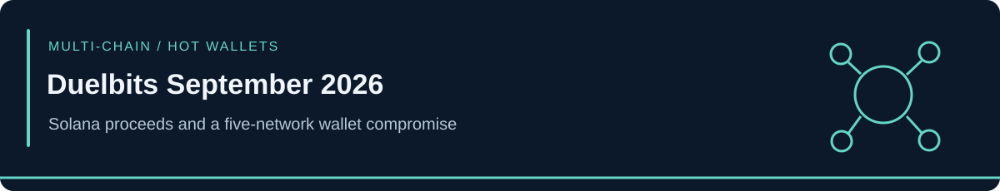

<!-- case-visual:start -->

  

<!-- case-visual:end -->

<!-- doc-nav:start -->

<a href="../../readme.md">Home</a> · <a href="../../wallets.md">Wallet index</a> · <a href="../../CATALOG.md">All case files</a> · <a href="../README.md">Parent index</a>

<!-- doc-nav:end -->

# Duelbits — September 2026 Multi-Chain Hot-Wallet Compromise

**Incident:** September 24, 2026. **Report cutoff:** September 28, 2026. **Repository verification:** September 29, 2026 UTC. This case supersedes the earlier truncated-only Duelbits lead in the [Bitget report](../Bitget-September-2026/).

| Field | Assessment |
|---|---|
| Affected infrastructure | Duelbits operational hot wallets |
| Networks reported | Solana, Ethereum, BNB Chain, TRON, Bitcoin |
| Classification | Multi-chain hot-wallet compromise; suspected private-key compromise |
| Project-reported total | Approximately **$7 million**; High confidence as a reported whole-incident estimate |
| Solana component | Approximately **$1 million** in subsequent tracing; Medium-High confidence pending a victim-published chain reconciliation |
| Root cause | Medium-High confidence in the security-firm assessment; no public technical postmortem establishes the initial access mechanism |
| Actor identity | Unknown |

<!-- contents:start -->

Contents

<ul>
<li><a href="#section-solana-monitoring-seed">Solana Monitoring Seed</a></li>
<li><a href="#section-scope-and-loss-reconciliation">Scope and Loss Reconciliation</a></li>
<li><a href="#section-mechanism-and-operational-status">Mechanism and Operational Status</a></li>
<li><a href="#section-monitoring-boundaries">Monitoring Boundaries</a></li>
<li><a href="#section-sources">Sources</a></li>
</ul>

<!-- contents:end -->

## Solana Monitoring Seed

`A3EBrhMBEGzcPgmbwywSPhW39G6PFGrorU8ib99T6yKw`

**Role:** Solana attacker/proceeds destination. **Confidence:** High for incident linkage. **Priority:** P1 direct watch and graph expansion.

[CertiK's public address alert](https://x.com/CertiKAlert/status/2103087561963110552) publishes the complete Solana identifier, also retained by the [Smart Contract Hacking incident registry](https://smartcontractshacking.com/hacks/duelbits-hack-2026). The exact identifier is in [addresses.csv](./addresses.csv). [View account on Solscan](https://solscan.io/account/A3EBrhMBEGzcPgmbwywSPhW39G6PFGrorU8ib99T6yKw).

The linkage does not establish a named operator or common ownership of every bridge, exchange, or downstream counterparty. No missing address characters are reconstructed. This update ingests the requested Solana seed; the cited alerts cover additional networks that require their own network-specific monitoring records.

## Scope and Loss Reconciliation

[SlowMist Hacked](https://hacked.slowmist.io/) records a five-network incident including Solana and the victim-confirmed total of approximately $7M. It links [co-founder Joe's public incident response](https://x.com/DuelbitsJoe/status/2103252719217627325). Those statements support a whole-incident estimate, rather than an independently audited allocation for each chain.

| Reporting stage | Approximate figure | Interpretation |
|---|---|---|
| Initial observations | $4.2–4.9M | Partial Ethereum, BNB Chain, and TRON tracing |
| Subsequent tracing | $5.9–6M | Expanded scope including 8.1 BTC and roughly $1M associated with Solana |
| Victim-confirmed total | $7M | Whole-incident estimate retained as the headline |

These are overlapping observation windows. Do not add them together. The precise Solana allocation and the difference between the traced subtotal and project total remain unreconciled. [Contemporaneous summary](https://www.gate.com/en-us/news/detail/duelbits-suffers-49m-6m-suspected-private-key-compromise-across-five-17880997).

## Mechanism and Operational Status

CertiK describes a possible private-key compromise; SlowMist classifies it as private-key leakage affecting hot wallets. The transaction pattern supports infrastructure/key compromise. It does not establish a vulnerability in Solana's runtime or a Solana smart contract. No specific CVE, malware family, key-exfiltration method, or named threat actor is assigned.

Investigators report that assets were swapped and bridged toward ETH. SlowMist's later entry reports that Duelbits relaunched on September 27 after pausing operations, and says user balances were unaffected. Those are dated operational statements; this case does not verify current withdrawal availability or claim that the stolen funds were recovered.

## Monitoring Boundaries

- Monitor the full Solana seed for funding, consolidation, swaps, and bridge interactions.
- Treat infrastructure and transaction neighbors as tracing pivots until independent evidence supports attribution.
- Keep the approximately $1M Solana component separate from the $7M overall estimate.
- The submitted September 28 “no newer Solana incident” statement describes the contributor's scan; it is not an exhaustive repository-wide negative finding.

## Sources

1. [CertiK address disclosure](https://x.com/CertiKAlert/status/2103087561963110552) and [initial incident alert](https://x.com/CertiKAlert/status/2103087558519624189).
2. [SlowMist Hacked tracker](https://hacked.slowmist.io/) — incident scope, reported total, classification, and later service status.
3. [Duelbits co-founder response](https://x.com/DuelbitsJoe/status/2103252719217627325).
4. [Smart Contract Hacking incident registry](https://smartcontractshacking.com/hacks/duelbits-hack-2026) — complete Solana identifier and links to security alerts.
5. [Gate summary of tracing estimates](https://www.gate.com/en-us/news/detail/duelbits-suffers-49m-6m-suspected-private-key-compromise-across-five-17880997).
