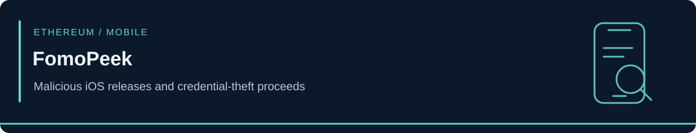
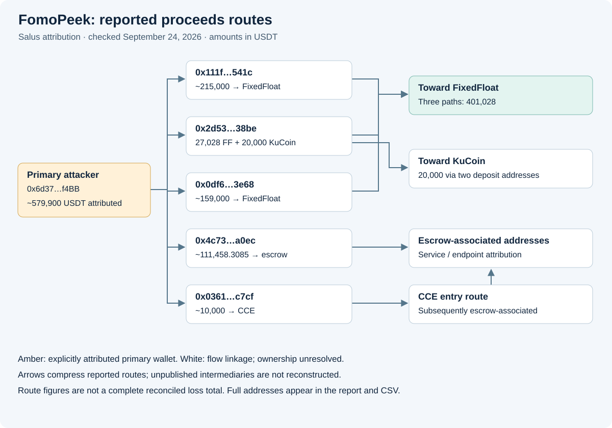

<!-- case-visual:start -->

  

<!-- case-visual:end -->

<!-- doc-nav:start -->

<a href="../../readme.md">Home</a> · <a href="../../wallets.md">Wallet index</a> · <a href="../../CATALOG.md">All case files</a> · <a href="../README.md">Parent index</a>

<!-- doc-nav:end -->

# FomoPeek — Malicious iOS Releases and Wallet-Credential Theft

| Field | Assessment |
|---|---|
| Public disclosure | September 19, 2026; joint SlowMist and OKX investigation |
| Payload introduction | September 9, 2026, version 1.1 / build 105 |
| Affected releases | Version 1.1 / build 105 and version 1.2 / build 110 |
| Classification | Malicious App Store application; kernel-exploit-assisted credential theft |
| Ecosystems | Marketed for Solana, Ethereum, and TRON; device-accessible secrets may extend beyond these chains |
| Impact | Approximately 579,900 USDT attributed by Salus; 579,984 USDT reported by SlowMist; victim count unresolved |
| Wallet ingestion | Six Ethereum records: one primary attacker and five proceeds pivots; ownership assessed separately |
| Confidence | High for reported malicious functionality and campaign linkage; operator identity unknown |
| Evidence cutoff | Original disclosure September 19; attribution update checked September 24, 2026 |

[SlowMist's alert](https://x.com/SlowMist_Team/status/2101211432541192615) and [OKX's corroborating announcement](https://x.com/OKXWallet_CN/status/2101213182253740536), reproduced in [The Crypto Times](https://www.cryptotimes.io/2026/09/19/slowmist-warns-fomopeek-ios-versions-may-expose-crypto-wallet-keys/), describe two hidden modules unrelated to the app's advertised tracking features. One contained an iOS kernel-exploitation framework with eight methods selected according to device and OS version.

If successful, that exploitation could escape the app sandbox, access/decrypt Keychain material, and read other applications' files. Potentially exposed information includes private keys, seed phrases, account credentials, messages, and files. Investigators also reported remote-command communications and captured plaintext configuration showing that exploitation was enabled for periodic execution. This establishes malicious capability and reported deployment, not proof that every installation succeeded in compromising its device.

<!-- contents:start -->

Contents

<ul>
<li><a href="#section-release-history">Release History</a></li>
<li><a href="#section-attribution-and-monitoring">Attribution and Monitoring</a></li>
<li><a href="#section-september-24-attribution-update">September 24 Attribution Update</a></li>
<li><a href="#section-sources">Sources</a></li>
</ul>

<!-- contents:end -->

## Release History

| Version | Build | Reported release | Package findings |
|---|---|---|---|
| 1.0 | Not retained | Earlier release | The two malicious frameworks were not found in the historical comparison |
| 1.1 | 105 | September 9 | Malicious modules first introduced |
| 1.2 | 110 | September 12 | Both modules retained |
| 1.3 | Not retained | September 17 | Both frameworks removed |

The [reported historical-package comparison](https://crypto.news/binance-warns-iphone-users-of-fomopeek-malware-targeting-crypto-wallets/) concerns official App Store releases, not merely sideloaded or re-signed packages. The four version records are preserved in [releases.csv](./releases.csv). Absence of these modules in one version is not a general safety certification, and removing them does not revoke secrets previously exposed.

The framework declares coverage across **iOS 12.0–18.7.x and 26.0–26.1**. This is a code-level compatibility claim, not evidence that every device/build in those ranges is exploitable. The supplied reporting does not provide a verified method-to-CVE mapping, so this case assigns no guessed CVE identifiers.

## Attribution and Monitoring

This is distinct from the [August FOMO iOS allegation](../August-2026-Security-Sweep/), whose verified transfer did not establish app causation. Similar branding is not evidence of common ownership. FomoPeek is a malicious application campaign rather than a Solana protocol exploit and is excluded from the single-incident Solana count.

The September 24 update supersedes the earlier zero-wallet assessment. Retain the release identifiers alongside the newly published wallet attribution. Reports of key exposure should be assessed against the specific device and installation history. SlowMist and OKX advised affected users to generate replacement credentials on a trusted device that never had the app installed and preserve relevant evidence.

No malicious application, executable framework, exploit implementation, or live command-server payload is included in this repository.

## September 24 Attribution Update

[Salus's published tracing](https://community.twstalker.com/salus_sec/status/2101530978141241459) identifies **`0x6d37f2C5e8F8546b648D317295565dA95975f4BB`** as the campaign's confirmed hacker address. It is a **High-confidence P1 primary attacker / stolen-fund consolidation seed**. Monitor incoming funding and outgoing transfers. This is credential theft enabled by malicious iOS software, not an Ethereum smart-contract exploit.

Salus estimates approximately **579,900 USDT** in proceeds. [SlowMist's comments reproduced by Cointelegraph](https://www.tradingview.com/news/cointelegraph:476d4b2dc094b:0-malicious-ios-app-fomopeek-linked-to-580k-crypto-theft-slowmist-says/) give **579,984 USDT** and activity beginning around September 15. These are closely aligned source estimates, not two losses to add together or a verified current balance. SlowMist confirmed application-data collection in a controlled environment, but did not establish extraction of keys from every wallet named in the operator configuration.

### Published Proceeds Pivots

| Ethereum address | Reported path | Amount (USDT) | Treatment |
|---|---|---:|---|
| `0x111faeb95cd0786593433bcc762dc5c1debf541c` | Toward FixedFloat | ~215,000 | P2 incident-flow watch and graph pivot |
| `0x2d53113c89c83c520c17b8bbcdc22aa0518a38be` | Toward FixedFloat and KuCoin | 27,028 + 20,000 | P2 direct proceeds monitoring |
| `0x0df6ac2e2856114228756947d1b1d9ff63ea3e68` | Toward FixedFloat | ~159,000 | P2 incident-flow watch and graph pivot |
| `0x4c73d7e8ef0e61129403e219debc597fd43aa0ec` | Escrow-platform transit | ~111,458.3085 | Contextual graph-expansion pivot |
| `0x0361897d757d13a4afad64a2e1bc561b96a8c7cf` | CCE entry, subsequently escrow-associated addresses | ~10,000 | P2 incident-flow watch and graph pivot |

All five have **High-confidence source-reported transaction linkage**, while controller identity remains unresolved. A service-route label does not establish that the intermediary is owned by that service or by the attacker. Only the primary address receives `threat_label=true` in [addresses.csv](./addresses.csv).

*Source: Salus, checked September 24. The diagram summarizes reported routes; edges may compress unpublished intermediate transactions. Full matching identifiers are in the table and CSV.*

The three FixedFloat routes total **401,028 USDT**. Salus describes the KuCoin leg as two 10,000-USDT transfers through two deposit addresses before hot-wallet consolidation. The escrow and CCE paths are retained separately, with the CCE route subsequently reaching escrow-associated addresses. These route amounts are not a complete, independently reconciled ledger of the approximately 580,000-USDT receipt. Do not infer missing deposit identifiers, add later legs as fresh losses, or label service infrastructure as attacker-owned.

### Attribution Expansion and Limits

Salus associates the group with a **June 2026 private-key theft**. Record this as **Medium-confidence common-actor linkage**; use of the same compromise technique is unresolved. [CryptoSlate](https://cryptoslate.com/rogue-iphone-app-escapes-ios-sandbox-to-hijack-580000-in-usdt/) describes a wider graph of 15 Ethereum/TRON address pairs. This update ingests only the six fully published Ethereum identifiers above. No undisclosed TRON counterpart or transaction hash is reconstructed.

The original kernel-exploitation and malicious-release findings come from SlowMist and OKX. The six-address attribution and detailed routes are credited specifically to Salus. The original X post is linked below; its reproduced text was readable through the linked public mirror during verification. Real-world identity, total victim count, and full graph coverage remain unknown. The supplied scan reported no separate qualifying BTC/SOL or major official cross-chain disclosure; that is a historical scan statement, not a new exhaustive search by this update.

## Sources

- [SlowMist — original September 19 alert](https://x.com/SlowMist_Team/status/2101211432541192615)
- [OKX Wallet — joint-investigation confirmation](https://x.com/OKXWallet_CN/status/2101213182253740536)
- [The Crypto Times — reproduced researcher findings and operating behavior](https://www.cryptotimes.io/2026/09/19/slowmist-warns-fomopeek-ios-versions-may-expose-crypto-wallet-keys/)
- [crypto.news — build and release timeline](https://crypto.news/binance-warns-iphone-users-of-fomopeek-malware-targeting-crypto-wallets/)
- [CCN — credential exposure and declared OS coverage](https://www.ccn.com/news/crypto/fomopeek-ios-malware-steals-crypto-wallet-seed-phrases/)

- [Salus — original wallet and route attribution](https://x.com/salus_sec/status/2101530978141241459) ([readable mirror](https://community.twstalker.com/salus_sec/status/2101530978141241459))
- [SlowMist — detailed investigation](https://x.com/SlowMist_Team/status/2101685605352841726)
- [Cointelegraph — approximately 580,000-USDT attribution and researcher qualifications](https://cointelegraph.com/news/fomopeek-ios-app-580k-crypto-theft) ([syndicated copy](https://www.tradingview.com/news/cointelegraph:476d4b2dc094b:0-malicious-ios-app-fomopeek-linked-to-580k-crypto-theft-slowmist-says/))
- [CryptoSlate — broader funds-flow graph](https://cryptoslate.com/rogue-iphone-app-escapes-ios-sandbox-to-hijack-580000-in-usdt/)
