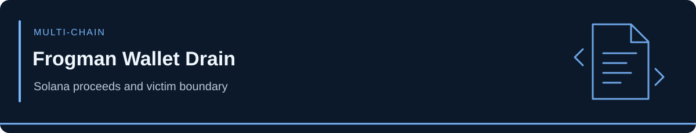

<!-- case-visual:start -->

  

<!-- case-visual:end -->

<!-- doc-nav:start -->

<a href="../../readme.md">Home</a> · <a href="../../wallets.md">Wallet index</a> · <a href="../../CATALOG.md">All case files</a> · <a href="../README.md">Parent index</a>

<!-- doc-nav:end -->

# Frogman — October 2026 Multi-Chain Wallet Drain

**Incident:** October 6–7, 2026. **Classification:** multi-chain wallet compromise; initial access and key/control vector unknown. This is not a Solana protocol exploit. Frogman reported losing **more than $4 million**, an overall victim claim rather than a Solana-only amount.

[Trenchbook reconstructed](https://trenchbook.app/dispatch/frogman-drain) a roughly 69-second drain across three networks. The Solana receiving wallet liquidated about 1.43 million BP for 13,053.6 SOL, then routed approximately 13,241 SOL through ten Privacy Cash deposits. Its follow-up identified 36 withdrawals totaling about 13,240 SOL to 32 newly active wallets. These are investigator observations at publication, not current balances or proof of post-privacy wallet ownership.

| Solana address | Role | Confidence and treatment |
|---|---|---|
| `69FnU8vszZSZF6DZCT6VHdsvm3DvvojDgbwqzHJ4cCFS` | Fresh receiving, liquidation and proceeds wallet | High incident-flow linkage; P1 direct proceeds watch; real-world operator unknown |
| `9wMSNoA7TzhwUjqsACVGEvzAxAibCHnsZTgXEAGov8zQ` | Independently identified suspected victim wallet | Context only; Frogman has not confirmed this exact wallet; **never threat-label** |

The [machine-readable records](./addresses.csv) keep the victim identification caveat. Privacy Cash contracts, withdrawals, exchanges and unrelated counterparties are graph pivots, not automatically attacker wallets. [Lookonchain also documented the incident](https://www.lookonchain.com/feeds/75672).
