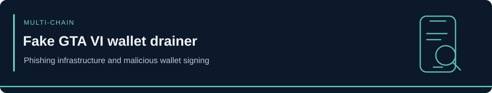

<!-- case-visual:start -->

  

<!-- case-visual:end -->

<!-- doc-nav:start -->

<a href="../../readme.md">Home</a> · <a href="../../wallets.md">Wallet index</a> · <a href="../../CATALOG.md">All case files</a> · <a href="../README.md">Parent index</a>

<!-- doc-nav:end -->

# Fake GTA VI Leak Wallet-Drainer Campaign

| Field | Assessment |
|---|---|
| Report date | September 1, 2026 |
| Classification | Wallet drainer, phishing, and malicious transaction signing |
| Networks | Solana plus remotely configured EVM targets |
| Confirmed Solana receiving address | `21iWU6FJWJ9FKKz4Jek2CyTh2x1fqs5jawjrNgE3nHjN` |
| Known infrastructure IOCs | Two malicious domains |
| Realized loss | Not publicly quantified |
| Confidence | High for campaign, code behavior, and hard-coded Solana destination |

<!-- contents:start -->

Contents

<ul>
<li><a href="#section-executive-assessment">Executive Assessment</a></li>
<li><a href="#section-direct-campaign-seed">Direct Campaign Seed</a></li>
<li><a href="#section-infrastructure-iocs">Infrastructure IOCs</a></li>
<li><a href="#section-separation-from-cyberleek">Separation from CYBERLEEK</a></li>
<li><a href="#section-monitoring-priorities">Monitoring Priorities</a></li>
<li><a href="#section-sources">Sources</a></li>
<li><a href="#section-tldr">TLDR</a></li>
</ul>

<!-- contents:end -->

## Executive Assessment

Malwarebytes ThreatLabs documented fake GTA VI leaked-copy and early-access pages that attempted to drain visitors' cryptocurrency wallets. The analyzed page contained a Solana-specific component that inspected a connected wallet's SOL balance, reserved only enough for transaction fees, and constructed a transfer of essentially the remaining balance to a hard-coded receiving address. The advertised one-SOL purchase price was not used in the transfer calculation.

The campaign also loaded an approximately 2.4 MB multi-chain drainer capable of inventorying wallet assets, estimating their value, and requesting malicious transactions or permissions across Ethereum, Polygon, BNB Smart Chain, Avalanche, Arbitrum, Base, and Fantom. The EVM destination could be changed remotely, consistent with configurable or rented drainer infrastructure.

## Direct Campaign Seed

| Network | Address | Role | Confidence | Treatment |
|---|---|---|---|---|
| Solana | [`21iWU6FJWJ9FKKz4Jek2CyTh2x1fqs5jawjrNgE3nHjN`](https://solscan.io/account/21iWU6FJWJ9FKKz4Jek2CyTh2x1fqs5jawjrNgE3nHjN) | Receiving address embedded in the analyzed Solana transfer code | High | P1 direct watch |

The address is a campaign-linked collection seed. The public report does not provide an aggregate loss, victim count, or evidence sufficient to attribute it to a named person or established threat group.

## Infrastructure IOCs

| Indicator | Type | Treatment |
|---|---|---|
| `centrodigestionedellarapina[.]life` | Malicious domain | Block, investigate, and pivot on related hosting or certificates |
| `dasunerforschtelandamendederwelt[.]sbs` | Malicious domain | Block, investigate, and pivot on related hosting or certificates |

## Separation from CYBERLEEK

This campaign exploits interest in alleged GTA VI leaks, but the reviewed evidence does not link its operator, wallet, or domains to the separate CYBERLEEK leak-and-token campaign. The two cases remain separate:

- CYBERLEEK is tracked as a leak-and-monetization campaign centered on a pre-positioned Solana token.
- This case contains confirmed wallet-draining code and a hard-coded Solana receiving address.

Shared branding and victim interest do not establish common control.

## Monitoring Priorities

1. Watch the Solana receiving address for victim inflows, consolidation, swaps, token-account creation, bridges, and exchange deposits.
2. Block the two published domains and pivot on hosting, certificates, redirectors, and replacement domains.
3. Treat EVM addresses loaded through remote configuration as campaign-specific only after complete identifiers and supporting evidence become public.
4. Keep victims, wallet providers, RPC endpoints, token contracts, and ordinary counterparties outside the actor cluster.

## Sources

- [Malwarebytes ThreatLabs — Fake GTA 6 leaked copy drains your crypto wallet](https://www.malwarebytes.com/blog/scams/2026/09/fake-gta-6-leaked-copy-drains-your-crypto-wallet)

---

## TLDR

The September 1 ThreatLabs report adds one high-confidence Solana drainer address and two malicious-domain IOCs. Realized losses remain unknown. The campaign is tracked separately from CYBERLEEK because a shared GTA VI lure is not evidence of shared control.
