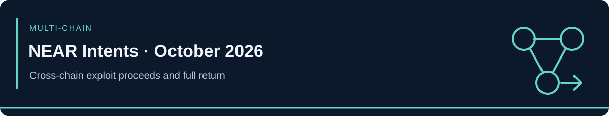

<!-- case-visual:start -->

  

<!-- case-visual:end -->

<!-- doc-nav:start -->

<a href="../../readme.md">Home</a> · <a href="../../wallets.md">Wallet index</a> · <a href="../../CATALOG.md">All case files</a> · <a href="../README.md">Parent index</a>

<!-- doc-nav:end -->

# NEAR Intents — October 2026 Exploit and Full Return

| Field | Current assessment |
|---|---|
| Incident | September 30–October 1, 2026 |
| Material status update | October 2, 2026 |
| Origin | NEAR Intents / Omni vault infrastructure on BNB Smart Chain |
| Classification | Deposit-withdrawal infrastructure interaction bug with cross-chain proceeds routing |
| Initial traced loss | 3,865,000 USDT / approximately $3.87M |
| Current status | Project states approximately $3.8M was returned in full; investigation stopped |
| Actor | Unidentified; no DPRK attribution established |

<!-- contents:start -->

Contents

<ul>
<li><a href="#section-executive-assessment">Executive Assessment</a></li>
<li><a href="#section-retained-historical-btc-iocs">Retained Historical BTC IoCs</a></li>
<li><a href="#section-recovery-addresses--explicit-non-threat-context">Recovery Addresses — Explicit Non-Threat Context</a></li>
<li><a href="#section-withheld-and-corrected-identifiers">Withheld and Corrected Identifiers</a></li>
<li><a href="#section-monitoring-priorities">Monitoring Priorities</a></li>
<li><a href="#section-sources">Sources</a></li>
<li><a href="#section-tldr">TLDR</a></li>
</ul>

<!-- contents:end -->

## Executive Assessment

Bitquery traced 99% of the original theft across six chains. At its October 1 snapshot, 34.69 BTC—about 76% of the stolen value—had reached four fresh Bitcoin destinations after the attacker converted and dispersed 3,865,000 USDT through 32 BNB Chain wallets, swap services, Chainflip, THORChain, NEAR Intents itself, and other infrastructure.

On October 2, NEAR Intents general manager Alex Shevchenko said the funds had been returned in full and that the investigation was ending. The relevant Bitcoin destinations therefore remain historical exploiter/proceeds IoCs, but they are no longer classified as active stolen-fund holding wallets.

## Retained Historical BTC IoCs

| Address | October 1 Bitquery snapshot | Current role | Treatment |
|---|---:|---|---|
| [`bc1qjkdzyt845q0vte6sax2nn9j40zdalec3q4zmrc`](https://mempool.space/address/bc1qjkdzyt845q0vte6sax2nn9j40zdalec3q4zmrc) | 9.5757 BTC | Historical exploit-proceeds wallet; funds returned | P2 historical IoC / graph pivot |
| [`bc1qkm5d88p472cg73n7tgw8dpv243v36jjmmnzktz`](https://mempool.space/address/bc1qkm5d88p472cg73n7tgw8dpv243v36jjmmnzktz) | 8.6713 BTC | Historical exploit-proceeds wallet; funds returned | P2 historical IoC / graph pivot |
| [`bc1q4kddgqsuqmwmzq3qgv0aq2jr9jgdwesx0wljen`](https://mempool.space/address/bc1q4kddgqsuqmwmzq3qgv0aq2jr9jgdwesx0wljen) | 0.6750 BTC | Historical exploit-proceeds wallet; funds returned | P2 historical IoC / graph pivot |

The classification transition is:

**active proceeds / consolidation → returned funds → historical exploit-proceeds graph**

## Recovery Addresses — Explicit Non-Threat Context

| Network | Address | Role |
|---|---|---|
| Bitcoin | [`bc1qjhv3hu8rfteh5e8exfmalvx2z3pzlmjlgnzxey`](https://mempool.space/address/bc1qjhv3hu8rfteh5e8exfmalvx2z3pzlmjlgnzxey) | Published BTC recovery destination; approximately 34.59 BTC reported received |
| Ethereum | [`0xB18a1aEDfde8B70FD67012C9E9c7a088B4d0C0e7`](https://etherscan.io/address/0xB18a1aEDfde8B70FD67012C9E9c7a088B4d0C0e7) | Published EVM recovery/contact destination |
| BNB Smart Chain | [`0xB18a1aEDfde8B70FD67012C9E9c7a088B4d0C0e7`](https://bscscan.com/address/0xB18a1aEDfde8B70FD67012C9E9c7a088B4d0C0e7) | Same hexadecimal recovery address, preserved as a separate network record |
| Solana | [`AHTfKaeRcaK1sbSG8MFJS2uPxLBChfenigNtvbWEkhKD`](https://solscan.io/account/AHTfKaeRcaK1sbSG8MFJS2uPxLBChfenigNtvbWEkhKD) | Published Solana recovery destination |

These are victim/recovery infrastructure and must not receive attacker labels or propagate malicious attribution to their counterparties.

## Withheld and Corrected Identifiers

- The largest resting BTC destination is not ingested. Bitquery's public article displays only `bc1qzsrxkz…vtn8`, while later public tracing exposes a conflicting full-address representation. Neither full address is promoted until the underlying transaction graph is reconciled.
- A truncated Lazarus-labeled EVM address is not ingested. Bitquery notes that post-disclosure dust sent to an OFAC-listed address could be a false flag and does not establish DPRK attribution.
- The fixed-ratio BTC distribution is an analytical lead only. It does not prove partners, fee sharing, or common ownership beyond the observed flow.

## Monitoring Priorities

1. Preserve the three retained BTC addresses for historical clustering and reuse detection.
2. Exclude recovery addresses from malicious-label propagation and active-proceeds alerts.
3. Reconcile the disputed largest BTC destination directly from the payout and return transactions before ingestion.
4. Keep KuCoin deposits, swap routers, Chainflip, THORChain, and other services as infrastructure pivots unless separately attributed.
5. Do not elevate the Lazarus/DPRK proximity claim without control evidence or authoritative attribution.

## Sources

- [Bitquery — NEAR Intents hack tracing](https://www.bitquery.io/investigations/near-intents-hack)
- [Alex Shevchenko — full-return announcement](https://x.com/AlexAuroraDev/status/2106049685928677585)
- [BeInCrypto — published BTC, EVM, and Solana recovery destinations](https://beincrypto.com/near-intents-hacker-identified-48-hours/)
- [The Defiant — recovery-wallet and full-return summary](https://thedefiant.io/news/hacks/near-intents-gm-says-3-8-million-in-hack-funds-returned-in-full)
- [Machine-readable indicators](./addresses.csv)

---

## TLDR

Three undisputed BTC proceeds wallets remain High-confidence historical IoCs after the full return. The disputed largest destination is withheld, and the BTC, EVM, and Solana recovery addresses are explicit non-threat context.
