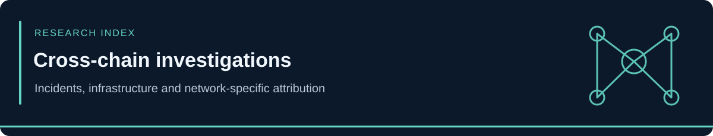

<!-- case-visual:start -->

  

<!-- case-visual:end -->

<!-- doc-nav:start -->

<a href="../readme.md">Home</a> · <a href="../wallets.md">Wallet index</a> · <a href="../CATALOG.md">All case files</a>

<!-- doc-nav:end -->

<h1>Multi-Chain Threat and Incident Index</h1>

<strong>Incidents and threat campaigns whose exploit execution, treasury compromise, bridge movement, proceeds flow, recovery activity, sanctions attribution, or malicious infrastructure spans more than one blockchain ecosystem.</strong>

<table>
  <thead>
    <tr><th align="left">Case</th><th align="left">Origin or affected networks</th><th align="left">Classification</th></tr>
  </thead>
  <tbody>
    <tr>
      <td><a href="./September-2026-Security-Sweep/"><code>September-2026-Security-Sweep/</code></a></td>
      <td>September 11–28 reports across Solana, Ethereum, and mobile-wallet users</td>
      <td>Eight cases, 37 role-separated indicators, updated FomoPeek and Bitget attribution, resolved ether.fi attribution, and reconciliation of repeated September 4–9 reports</td>
    </tr>
    <tr>
      <td><a href="./Duelbits-September-2026/"><code>Duelbits-September-2026/</code></a></td>
      <td>Solana, Ethereum, BNB Chain, TRON, Bitcoin</td>
      <td>September 24 hot-wallet compromise; $7M project-reported total, roughly $1M Solana tracing estimate and one P1 Solana seed</td>
    </tr>
    <tr>
      <td><a href="./Bitget-September-2026/"><code>Bitget-September-2026/</code></a></td>
      <td>Ethereum, XRP Ledger, five other named EVM chains, downstream Bitcoin and TRON</td>
      <td>September 24 exchange breach; two P1 TRM-linked wallets, one P2 provisional dispersal pivot; DPRK link remains a Medium-confidence hypothesis</td>
    </tr>
    <tr>
      <td><a href="./Fetch-NuNet-SingularityNET/"><code>Fetch-NuNet-SingularityNET/</code></a></td>
      <td>Ethereum execution with Cardano and BNB Chain effects</td>
      <td>September 19–20 privileged-key compromise, converter drain, unauthorized minting, and two P1 Ethereum seeds</td>
    </tr>
    <tr>
      <td><a href="./FomoPeek/"><code>FomoPeek/</code></a></td>
      <td>iOS credentials; Solana, Ethereum, and TRON users</td>
      <td>September 19 malicious-application disclosure; September 24 update adds one attacker seed and five proceeds pivots; approximately 580,000 USDT attributed</td>
    </tr>
    <tr>
      <td><a href="../SOL/Dominion-SILV/"><code>SOL/Dominion-SILV/</code></a></td>
      <td>Solana key compromise and Chainflip payouts on Ethereum</td>
      <td>September 11 treasury theft; custody, signer control, Ethereum proceeds, and possible service endpoints separated</td>
    </tr>
    <tr>
      <td><a href="./Nesa-Cosmos-EVM/"><code>Nesa-Cosmos-EVM/</code></a></td>
      <td>Nesa through Hyperlane to Ethereum</td>
      <td>August 24 exploit with a September 8 Ethereum attribution report: one P1 bridge recipient, one P2 liquidation seed, and incomplete source-chain technical attribution</td>
    </tr>
    <tr>
      <td><a href="./Across-Protocol/"><code>Across-Protocol/</code></a></td>
      <td>Solana origin; fraudulent fills across multiple destination chains; Ethereum recovery activity</td>
      <td>Off-chain event-parser and relayer exploit</td>
    </tr>
    <tr>
      <td><a href="./Allbridge-Core/"><code>Allbridge-Core/</code></a></td>
      <td>Two 2026 incidents across Solana, Ethereum, Polygon, and Base</td>
      <td>July Solana pool-accounting exploit plus distinct August Base/CCTP message-validation exploit</td>
    </tr>
    <tr>
      <td><a href="./August-2026-Security-Sweep/"><code>August-2026-Security-Sweep/</code></a></td>
      <td>MAYAChain, Bitcoin, Ethereum, Solana, Nesa, Nomic, Osmosis, Injective, ICON, Sonic, Cronos, Arbitrum, BNB Chain, Harmony, TRON, Polygon, Base, and multi-chain users</td>
      <td>August 20-September 9, 2026 cross-ecosystem sweep covering Nesa, the Xinbi sanctions set, the zero-seed Nomic review, the Liquid unauthorized peg-out, RedSonic, the suspected GoMining-linked drain, Dream Health Chain, COLDCARD CoinJoin movement, and the earlier DOJ/FBI Hamas, GTA VI drainer, Rain, Aquifer, and ICON updates</td>
    </tr>
    <tr>
      <td><a href="./Coldcard-Weak-Entropy-Theft/"><code>Coldcard-Weak-Entropy-Theft/</code></a></td>
      <td>Bitcoin theft and THORChain routing into Ethereum</td>
      <td>Weak-entropy hardware-wallet theft with six confirmed Bitcoin seeds, three complete Ethereum proceeds destinations, September Wave 3 CoinJoin movement, and explicit cross-wave and service-infrastructure boundaries</td>
    </tr>
    <tr>
      <td><a href="./Liquid-Network-Peg-Out/"><code>Liquid-Network-Peg-Out/</code></a></td>
      <td>Liquid / Elements to Bitcoin mainnet</td>
      <td>September 6 unauthorized peg-out and September 7 partial recovery: P1 consolidation wallet, P2 payout intermediary, 3,400 BTC returned, four complete transactions, and an explicit federation-reserve exclusion</td>
    </tr>
    <tr>
      <td><a href="../EVM/Ethereum/Suspected-GoMining-Drain/"><code>EVM/Ethereum/Suspected-GoMining-Drain/</code></a></td>
      <td>Multiple source networks to Ethereum consolidation</td>
      <td>Coordinated multi-wallet drain with one P2 consolidation seed and an explicitly provisional GoMining ecosystem association</td>
    </tr>
    <tr>
      <td><a href="./ICON-Migration-Replay-Exploit/"><code>ICON-Migration-Replay-Exploit/</code></a></td>
      <td>ICON exploit execution, Sonic collateral activity, and Ethereum proceeds consolidation</td>
      <td>August 27 signed-message replay and withdrawal-uniqueness exploit with three officially identified attacker-controlled accounts represented as four chain-specific records</td>
    </tr>
    <tr>
      <td><a href="./Iranian-MOIS-Cyber-Network/"><code>Iranian-MOIS-Cyber-Network/</code></a></td>
      <td>Bitcoin, Ethereum, and TRON</td>
      <td>August 24, 2026 OFAC attribution: 30 direct seeds for four MOIS-linked cyber actors plus one separate Iran sanctions-finance USDT/TRON seed</td>
    </tr>
    <tr>
      <td><a href="./Hamas-Al-Qassam-Financing/"><code>Hamas-Al-Qassam-Financing/</code></a></td>
      <td>TRON and BNB Smart Chain</td>
      <td>Official DOJ/FBI fundraising, consolidation, laundering, money-mule, and financier attribution with 18 role-separated monitoring records</td>
    </tr>
    <tr>
      <td><a href="./GTA-VI-Wallet-Drainer/"><code>GTA-VI-Wallet-Drainer/</code></a></td>
      <td>Solana users plus remotely configured EVM targets</td>
      <td>Fake GTA VI leaked-copy and early-access wallet-drainer campaign with one Solana receiving seed and two domain IOCs</td>
    </tr>
    <tr>
      <td><a href="./Shelbit-Network/"><code>Shelbit-Network/</code></a></td>
      <td>Bitcoin, Ethereum, Solana, and TRON</td>
      <td>August 7, 2026 OFAC counterterrorism sanctions attribution covering Siavash Kayvanpour, Shelbit Exchange, and Crypto Home DMCC</td>
    </tr>
    <tr>
      <td><a href="./SpaceX-FIFA-Drainers/"><code>SpaceX-FIFA-Drainers/</code></a></td>
      <td>Solana and EVM users; broader campaign set also used direct Bitcoin and Ethereum deposit scams</td>
      <td>Wallet-drainer, malicious dApp, fake-token, impersonation, and investment-scam campaign</td>
    </tr>
    <tr>
      <td><a href="./Triple-A/"><code>Triple-A/</code></a></td>
      <td>Ethereum, Solana, TRON, TON, Polygon, Arbitrum, Bitcoin, and related routing</td>
      <td>Multi-chain treasury-wallet compromise and proceeds consolidation</td>
    </tr>
  </tbody>
</table>

<!-- contents:start -->

Contents

<ul>
<li><a href="#section-storage-rule">Storage Rule</a></li>
<li><a href="#section-attribution-boundaries">Attribution Boundaries</a></li>
</ul>

<!-- contents:end -->

<h2>Storage Rule</h2>

A case is stored under <code>Multi-Chain/</code> when the full investigation cannot be accurately represented by one chain directory. Each report still records the exact exploit-origin chain, vulnerable deployment, destination networks, proceeds chains, recovery networks, sanctions programs, campaign targets, and address roles separately.

Solana-origin cases are also cross-listed in <a href="../SOL/"><code>SOL/README.md</code></a> so chain-specific incident counts do not omit cross-chain cases such as Across Protocol or Allbridge Core. Multi-victim campaigns such as the SpaceX/FIFA and fake GTA VI drainer waves are cross-referenced there but are not counted as single Solana protocol incidents. Official multi-chain sanctions and law-enforcement attribution cases are cross-linked from the affected chain indexes but are not counted as exploit incidents.

<h2>Attribution Boundaries</h2>
<ul>
  <li>Bridge, relayer, exchange, router, protocol, victim, vault, and recovery addresses are not automatically classified as threat-controlled.</li>
  <li>Attacker seeds and proceeds wallets require a complete address and evidence-supported role.</li>
  <li>Official OFAC digital-currency identifiers are direct sanctions-watch seeds; transactional proximity to them does not automatically transfer the sanctioned entity or actor label.</li>
  <li>Origin-chain classification describes where an exploit or drain began; proceeds-chain classification describes where stolen assets later moved.</li>
  <li>Campaign domains, token lures, commercial drainer-kit names, and receiving addresses should remain separate indicator classes rather than being collapsed into a single actor attribution.</li>
</ul>
