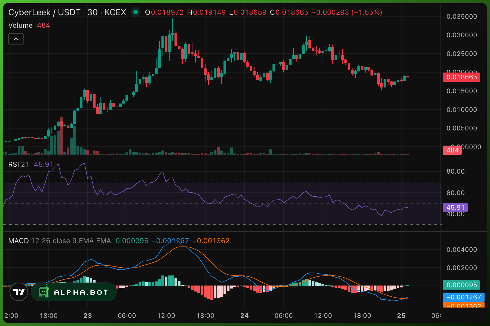
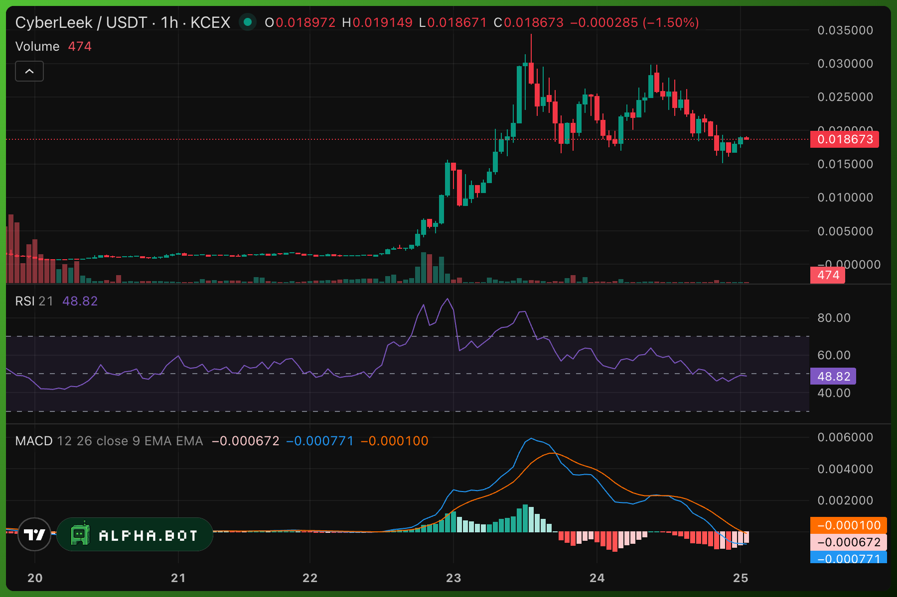

# CYBERLEEK / GTA VI Leak-and-Token Campaign

| Field | Assessment |
|---|---|
| Assessment date | August 25, 2026 UTC |
| Status | Active; identity unresolved |
| Primary target | Rockstar Games / Take-Two Interactive |
| Primary blockchain | Solana |
| Classification | Pseudonymous IP-disclosure and monetization campaign with a pre-positioned event token |
| Analytic confidence | High on token, deployer, pool, burn, and locked-liquidity mechanics; moderate on campaign-level wallet linkage; low on real-world attribution and initial access |

> This report excludes leaked game files, direct links to the campaign's infrastructure, and unverified real-person identification. Blockchain identifiers are included for defensive monitoring and reproducible analysis. Inclusion of an address does not by itself establish criminal control; consult `addresses.csv` for the attribution scope and threat-label field.

## Executive Assessment

CYBERLEEK is an unidentified person or group that began publicly releasing apparent Grand Theft Auto VI development footage on August 18, 2026. The strongest public evidence supports access to a playable build or playable portion: a later clip showed the operator creating the word `LEEK` with bullet impacts in-game. That bespoke action is difficult to reconcile with possession of pre-recorded tester footage alone. It does not establish that CYBERLEEK personally breached Rockstar, possessed the complete game, obtained source code, or retained access to Rockstar systems. The acquisition method remains unknown.

The operation was prepared as a monetized leak campaign. A branded Arweave name was purchased on August 14, the Solana token began trading on August 15, and the first major public leak arrived on August 18 carrying token promotion. The token therefore preceded the publicity event rather than emerging organically afterward. Bitquery reproduced the chronology from public timestamps and Solana activity and found that the five highest-profit early traders were automated or fast traders with no identified deployer funding link.

The creator's financial position is more nuanced than a conventional developer dump:

- The creator minted 1 billion CYBERLEEK, placed 730 million tokens and approximately 330 SOL into a Raydium CPMM pool, and initially retained 270 million tokens.
- The retained 270 million tokens were burned on August 22 rather than sold. Their contemporaneous headline value was unrealized mark-to-market value, not cash received by the creator.
- Approximately 98.43% of the live Raydium LP supply originating from the creator was permanently locked through Raydium Burn & Earn. The locked principal cannot be conventionally withdrawn.
- A Fee Key NFT preserves the right to claim trading fees associated with the locked position. Permanent liquidity does not eliminate the creator's continuing fee interest.
- A reproducible community analysis estimated approximately $128,809 in gross LP-fee accrual through August 23. It found no fee-harvest transaction by its cutoff, so that figure is accrued or potential revenue, not confirmed realized profit.
- Bitquery estimated that the five highest-profit early wallets realized approximately $157,643 combined and found no link between those traders and the deployer. Their profits must not be attributed to CYBERLEEK without new evidence.

The campaign also advertised custom gameplay and ad placement. Public reporting described a 400 XMR contact fee, approximately $165,000 at the quoted exchange rate, before private negotiation through Session. No public evidence establishes that anyone paid the fee, and ordinary public-chain analysis cannot verify Monero receipts.

No credible public evidence currently links CYBERLEEK to the September 2022 LAPSUS$ / `teapotuberhacker` GTA VI breach or the April 2026 ShinyHunters incident. Treat those as separate cases unless new evidence establishes overlap.

## Key Judgments

| Judgment | Confidence | Basis |
|---|---|---|
| CYBERLEEK controlled or accessed a playable GTA VI build or partial build. | High | Operator-created `LEEK` action, repeated new footage, and Take-Two enforcement activity. |
| The released footage includes authentic Take-Two / Rockstar copyrighted material. | High | Repeated copyright removals and federal filings in which Take-Two described the material as its copyrighted content. |
| The Solana token and leak publicity formed one coordinated campaign. | High | Token and branded infrastructure preceded the leak; the footage promoted the asset and later releases were tied to token milestones. |
| Monetization was a central operational objective. | High | Token launched first; market-cap gates, advertising, custom footage, and a Monero contact fee followed. |
| CYBERLEEK personally hacked Rockstar. | Unknown | No confirmed initial-access vector or public forensic report. Access could reflect intrusion, insider transfer, purchase, brokerage, or another breach. |
| The creator dumped the retained 270 million-token allocation. | Contradicted | On-chain `burnChecked` removed the entire allocation on August 22. |
| The creator can conventionally rug the original pool by minting, freezing, or withdrawing the locked LP. | Low | Mint and freeze authorities are null; the creator allocation was burned; approximately 98.43% of the original LP position is locked. |
| The creator has no continuing financial interest. | Contradicted | The Fee Key retains LP-fee claim rights; advertising and Monero contact fees are separate possible revenue paths. |
| The five highest-profit early traders were deployer-linked insiders. | Low / unsupported | Bitquery characterized them as automated or fast traders and found no deployer funding link. |
| Launch funding originated at KuCoin. | Low-to-moderate | Community tracing reports a KuCoin endpoint; Bitquery reproduced the middle hops but could not independently label the exchange terminus. |
| The operator is in Central Europe. | Low-to-moderate | Wallet-signing and social-posting hours align with UTC+1/+2, but scheduling, teamwork, travel, or deception could produce the same pattern. |

## Campaign Profile

| Field | Assessment |
|---|---|
| Alias | CYBERLEEK / Cyberleek |
| Actor type | Pseudonymous leak-and-monetization operation; individual versus group unknown |
| First observable preparation | July 22 social-account creation reported by Bitquery; August 14 branded Arweave-name purchase |
| Public campaign start | August 18, 2026 |
| Victim | Rockstar Games / Take-Two Interactive |
| Stated motive | Opposition to digital preorders, paid unlocks for content already shipped, and the absence of offline fallback |
| Assessed motive | Mixed ideological branding, notoriety, leverage, and direct monetization; financial motive is strongly evidenced |
| Claimed capability | Continued disruption and possession of a playable GTA VI build |
| Supported capability | Repeated release of apparently authentic footage; access sufficient to generate custom in-game actions |
| Unknown capability | Original intrusion, persistence in Rockstar systems, source-code access, or possession of the complete production build |
| Distribution | Social media, community mirrors, Discord/GitHub-associated communities, and Arweave-backed infrastructure |
| Monetization | Solana event token, locked-liquidity fee stream, market-cap-gated content, Monero contact fee, advertising, and custom footage |
| Operational status | Active as of August 24-25; no confirmed arrest or authoritative public identification |

## Timeline

| Date and time UTC | Event | Assessment |
|---|---|---|
| 2026-07-22 | Reported creation of the campaign's social account. | Preparation likely began weeks before public disclosure. |
| 2026-08-14 18:30 | Branded Arweave / ArNS name purchased for 13,878 ARIO. | Infrastructure existed before public leak activity. |
| 2026-08-15 14:20 | CYBERLEEK mint created. | High-confidence on-chain event. |
| 2026-08-15 14:30 | 270M tokens separated; 730M remained for liquidity. | Initial 27% creator-controlled allocation. |
| 2026-08-15 20:47 | Funding funnel delivered 311.42 SOL to the deployer. | Main pool capital arrived about 20 minutes before launch. |
| 2026-08-15 21:07 | Raydium pool initialized with 730M CYBERLEEK and roughly 330 SOL total seed capital. | Token began near an estimated $55K fully diluted valuation. |
| 2026-08-15 21:19 | Creator LP locked through Raydium Burn & Earn; Fee Key NFT minted. | Liquidity became non-redeemable while fee rights remained transferable and claimable. |
| 2026-08-16 | Token announced with little initial attention. | Trading activity remained limited before the leak. |
| 2026-08-18 about 17:00 | GTA VI footage and map material released with token promotion. | The leak functioned as the token's breakout advertisement. |
| 2026-08-18 17:00-19:00 | Price moved about 13x in the first hour; the following hour reached approximately $0.00348. | Principal initial pump; approximately $6.9M two-hour volume. |
| 2026-08-18 17:48-17:54 | Five highest-profit early wallets entered in a six-minute interval. | Bitquery assessed bots and fast traders, not deployer-linked insiders. |
| 2026-08-20 | A clip showed the operator writing `LEEK` with in-game gunfire. | Strong evidence of playable access. |
| 2026-08-20-21 | Take-Two sought DMCA subpoenas for Microsoft and Discord records; later requests targeted Google and X. | Formal identification effort; September 4 production date reported. |
| 2026-08-21 | Campaign advertised 400 XMR contact access and custom/advertising opportunities; content releases were tied to token milestones. | Monetization expanded beyond the token. |
| 2026-08-22 18:27:59 | Entire 270M creator allocation burned. | No developer-allocation dump occurred. |
| 2026-08-23 | CoinGecko recorded an all-time high near $0.03436. | Second major speculative surge followed by material retracement. |
| 2026-08-24 | Campaign messaging called for physical demonstrations at Rockstar / Take-Two offices. | Escalation into real-world nuisance activity; no verified violence threat in the reviewed material. |
| 2026-08-25 | Price snapshot near $0.0178-$0.0182 with roughly $12.9M-$13.2M market capitalization. | Approximately 48% below the August 23 high; values are time-sensitive. |

## Leak and Access Assessment

### Supported

- Multiple apparently authentic clips appeared beginning August 18.
- A bespoke in-game action supports direct playable access rather than mere possession of pre-recorded tester footage.
- Take-Two described the material in federal filings as copyrighted audiovisual and creative content and sought identifying records from service providers.
- The campaign connected content releases to token promotion and later advertised custom footage and ad placement.
- Arweave and on-chain components increased resilience against ordinary takedown actions.

### Not Established

- That CYBERLEEK conducted the original compromise.
- That the actor possesses the complete retail build, source code, or persistent Rockstar access.
- That a claimed dead-man switch or automatic full-build release exists.
- That every circulated map image is an untouched internal asset.
- That CYBERLEEK distributed malware. A fake 113 GB GTA VI ISO containing a reported malicious payload appeared after the leak, but no reviewed evidence attributes it to CYBERLEEK; treat it as opportunistic copycat activity.

## Token Analysis

### Primary Asset

| Field | Value |
|---|---|
| Name / ticker | CyberLeek / CYBERLEEK |
| Chain | Solana |
| Mint | [`ApZuxdpzMrbEYTGEzeY9afh5pj9d6qPRJCTgQYiipbKg`](https://solscan.io/token/ApZuxdpzMrbEYTGEzeY9afh5pj9d6qPRJCTgQYiipbKg) |
| Initial supply | 1,000,000,000 |
| Current tracked supply | Approximately 729.96M after the 270M burn and minor later burns |
| Primary venue | Raydium CPMM |
| Primary pool | [`G8kgi7aUpeX8EVR8VMkrth9SKEv5BietWC33UjAiiMGh`](https://solscan.io/account/G8kgi7aUpeX8EVR8VMkrth9SKEv5BietWC33UjAiiMGh) |
| Initial pool seed | Approximately 730M CYBERLEEK plus 330 SOL |
| Mint authority | Revoked / null |
| Freeze authority | Revoked / null |
| Creator allocation | 270M; burned August 22 |
| Creator LP status | Approximately 98.43% of live LP supply permanently locked at the reviewed snapshot |
| Continuing fee right | Yes; Fee Key NFT controls claims from the locked position |

### Market Path

| Point | Approximate observation | Meaning |
|---|---|---|
| Initial trading, August 15 | About $55K FDV; implied price near $0.000055 | Token launched before the public leak. |
| Leak hour, August 18 | $0.0000519 open to $0.000685 close; $1.47M volume | Approximately 13x in one hour. |
| Following hour | High near $0.00348; $5.47M volume | Largest initial pump candle. |
| By August 18 23:00 | FDV near $3.3M | Roughly 60x the pre-leak valuation. |
| By August 21 | Valuation near $1.3M | First major retracement. |
| August 23 ATH | CoinGecko high near $0.03436 | Approximately 625x the implied launch price before retracement. |
| August 25 snapshot | About $0.0178-$0.0182; market cap about $12.9M-$13.2M; high turnover relative to liquidity | Approximately 48% below the ATH; snapshot values are volatile. |

### Market Chart Snapshots

#### 30-Minute CYBERLEEK / USDT

#### 1-Hour CYBERLEEK / USDT

> These user-supplied KCEX charts are static market snapshots captured on August 25, 2026. They document the displayed price action and technical indicators but are not evidence of wallet control, actor identity, or on-chain attribution.

### Burns, Liquidity, and Gains

| Party or event | Amount | Attribution treatment |
|---|---:|---|
| Creator's 270M allocation | Entire balance burned; nominal value near $1.4M at the time | Not a dump and not realized profit. High-confidence burn event. |
| Creator's locked-LP fee stream | Rough estimate of $128,809 gross accrued through August 23 | Plausibly controlled through the Fee Key; no harvest found by the cited analysis at its cutoff. Treat as potential/accrued revenue. |
| Creator's initial SOL seed | About 330 SOL; approximately $29K-$31K at contemporary prices | Permanently committed principal in the locked creator position. |
| 400 XMR contact fee | About $165K requested per contact | Demand only; no verified payer or receipt. |
| Advertising and custom footage | Privately negotiated | Revenue unknown; no confirmed completed deal. |
| Five highest-profit early traders | Approximately $157,643 realized combined | Bitquery found no deployer link; do not attribute to CYBERLEEK. |
| Four same-ticker copycat mints | Approximately $1.63M combined early-window volume | Separate assets; do not merge with the primary mint or actor attribution. |

The $128,809 estimate used approximately $62.316M cumulative pool volume multiplied by a 0.21% LP-fee share and approximately 98.43% ownership of the locked LP position. It is an analytical estimate, not proof of collection, net profit, or present value. The pool's separate 0.05% creator-fee field was reportedly configured but disabled; the Fee Key is the supported continuing revenue mechanism.

## Indicator Handling

The complete machine-readable set is in [`addresses.csv`](./addresses.csv). Only one row is marked as a direct actor-controlled wallet: the creator / pool-creator wallet. Other entries include campaign infrastructure, historical token accounts, financial-flow pivots, excluded traders, and copycat assets. Use the `attribution_scope`, `monitoring`, and `threat_label` columns before importing data into a threat-wallet system.

### Direct or Strongly Linked Indicators

| Indicator | Role | Confidence | Recommended treatment |
|---|---|---|---|
| `ApZuxdpzMrbEYTGEzeY9afh5pj9d6qPRJCTgQYiipbKg` | Primary CYBERLEEK token mint | High | Watch the exact mint; asset infrastructure, not an actor wallet. |
| `Hok9nbV89yBSKCttxe3goqajwbiqQa9mtHvQBsbJH3Np` | Token creator and Raydium pool creator | High | P1 direct actor-wallet watch. |
| `EVQ9RCaHggai12cje6vTtFfNkhBuJfFZHhbgB3yyprVw` | Original 1B-token account | High | Historical evidence; current balance zero; not a wallet-level attribution. |
| `CbfbaNpCGV64g2fbLBC2NXKSygeJJuC7S6i36cy8RMPo` | 270M allocation account and burn source | High | Historical evidence; monitor account reuse; not a standalone actor wallet. |
| `G8kgi7aUpeX8EVR8VMkrth9SKEv5BietWC33UjAiiMGh` | Primary Raydium CYBERLEEK / WSOL pool | High | Pool and liquidity monitoring; do not threat-label protocol infrastructure. |
| `44isRZNypWAsseobWTKLcQP56A3STe8Um7XdstgFttrS` | Raydium Fee Key NFT | High | Critical revenue indicator; alert on transfer, sale, or fee collection. |
| `Ec2qmcpCCD9hjahAcquiQf5JkZWCK68BUahCje1izYC7` | Purpose-built funding funnel into the deployer | High transaction linkage; unresolved ownership | P1 financial-support pivot; do not automatically inherit actor control. |

### Contextual Funding-Chain and Expansion Pivots

| Indicator | Observed role | Confidence and caveat |
|---|---|---|
| `BS9f2jetmcwafD2AVrZMvdSf5qrsNNqdgVRifsRHWhci` | High-volume upstream service / hub; community alleged a phishing-proceeds link | Medium transaction-path confidence; low actor-control or phishing-attribution confidence. |
| `J4zoc1rFgpP2Mrknb48BRRoQW9P5GiVtPyuemkKMpAnV` | High-volume hub | Medium; alleged KuCoin-side route remains unconfirmed by an on-chain label. |
| `26sZDubW854zGAasvrUaRAgY54MiC97CEHWZKPRMPMQ9` | Relay that forwarded 156 SOL | Medium-high observed flow; ownership unknown. |
| `EjsB4qhcQv3zwXWqMbD739VA7nFc85f2egwTnkr3KGB2` | Relay; 10 SOL test followed by 146 SOL | Medium-high observed flow; ownership unknown. |
| `2ZdUUvrr7ANY2rzpbyBcZHp1hTZ5uTY8JZ4vFnYnvJhD` | Relay into the feeder layer | Medium-high observed flow; ownership unknown. |
| `2KxnXdbED2btp36CZzouUiEXz5aPR38BvxZfhC3D1woZ` | One feeder into the funnel | Medium-high observed flow; cluster ownership inferred, not established. |
| `MDBLoJyK6WuymugTKojo9Sg3K3ap9e6xR1jFrjYQo4j` | Downstream side-token deployer funded by the main deployer | Medium campaign-expansion pivot; do not promote to confirmed actor wallet. |
| `FYzoZbGvPsHqXSe8czHgpJPiHXnFUBXoX1z8EBQKSEpA` | Downstream Rockstar-themed token deployer funded by the main deployer | Medium campaign-expansion pivot; monitor new launches and promoter links. |
| `CMLqxbQU7CDKqzWPpAbKTgiQKuPV1tzYZNLyDjr1BwZz` | Secondary Meteora pool | Market-monitoring pivot; protocol infrastructure, not an actor wallet. |

Do not trace with truncated Solana addresses. Bitquery documented look-alike dust transfers around the funding chain and cautioned that they may be ambient poisoning bots rather than CYBERLEEK-operated decoys. Always match the complete case-sensitive base58 string.

### External Early Winners — Not Actor Indicators

| Wallet | Realized gain | Behavior assessment |
|---|---:|---|
| `tAg2tgyHmkGTsmq8wBSKsGvUUgoH37cxmCfRUZSXdtB` | $48,706 | High-frequency Axiom-terminal behavior; 713 token trades. |
| `kai5bkDZS9jvapW5bWopzKDHJVagamTxZbAn4u4r5Ya` | $34,657 | Automated sniper cluster with self-seeded sub-wallets. |
| `HmBPYtybyKVuWALbJSJ9yRawL85Scc9Vo3ycmP8mXois` | $25,072 | Axiom-routed fast trade; flat within about 65 minutes. |
| `71CBfHX36b2wNjeBui59UDwzFWW6SMemHWWzTBWSxy4t` | $24,979 | Exchange-funded discretionary whale; source funds predated the token. |
| `J6oZ2HNye8cQAmJASzK7nDqbTg2vrS956UqKKC6MLb9h` | $24,229 | High-frequency profile consistent with terminal or bot trading. |

These addresses are retained for market-abuse and timing analysis only. Available evidence does not support labeling them CYBERLEEK-controlled.

### Copycat Mints — Not Attributed to CYBERLEEK

- `7cTj9kKPwDskZfnQfdYxrEe1osGSxNHnvh4jWysgzyCd`
- `AKEB7SwHKs3EmSHipWkcwnh6YgDjNbwuixwwDgBgw8EB`
- `DCHKemF4rpVvS5FGCzs7YSWQUcApjJJHpTVdXujDpump`
- `BM2a4nXYH8nxqX1iifn5y3ipFJRSzZ4pYN3HJHasTz6w`

These assets shared the ticker or narrative and generated material volume, but the reviewed analysis does not connect them to the primary deployer.

## Key Transaction Evidence

The machine-readable transaction set is in [`transactions.csv`](./transactions.csv).

| Transaction | Event |
|---|---|
| [`2GPHLpAn4pcLyMT5aLietwUhX7LHoW9ELWJqtXnRGzB8kZkp5HMGaD7kfHm1LvP9JfBuAhJR9MauUoYdcH3cPqbq`](https://solscan.io/tx/2GPHLpAn4pcLyMT5aLietwUhX7LHoW9ELWJqtXnRGzB8kZkp5HMGaD7kfHm1LvP9JfBuAhJR9MauUoYdcH3cPqbq) | 270M allocation separated from the original token account on August 15. |
| [`JyNCGXB3uxRzr5AL47SpBgwAvEW8UMkPfiZ1w7oDcUn5bjarQdTxtseBaKY89ZNkt3SfsmpduXwvdaQmLzUMoLN`](https://solscan.io/tx/JyNCGXB3uxRzr5AL47SpBgwAvEW8UMkPfiZ1w7oDcUn5bjarQdTxtseBaKY89ZNkt3SfsmpduXwvdaQmLzUMoLN) | 730M tokens deposited during Raydium pool initialization on August 15. |
| [`4jvfbVcdiHkCEgPj59dbPEnJL12W379YW4HeDZZmByrEKApdDTJwWxoECQRrJNLMWqcq32YnbAkBYPb5bY5Teja3`](https://solscan.io/tx/4jvfbVcdiHkCEgPj59dbPEnJL12W379YW4HeDZZmByrEKApdDTJwWxoECQRrJNLMWqcq32YnbAkBYPb5bY5Teja3) | Creator LP locked and Fee Key minted on August 15. |
| [`3EeEqdrYZKNPxoL3qcxK3LDbavPrn7skpAvjyuAxmLihpjc6qerQ1ZrqDv4kGPCkgEueC48nMqoeeZusAQ8Vsn3C`](https://solscan.io/tx/3EeEqdrYZKNPxoL3qcxK3LDbavPrn7skpAvjyuAxmLihpjc6qerQ1ZrqDv4kGPCkgEueC48nMqoeeZusAQ8Vsn3C) | `burnChecked` of 270M CYBERLEEK on August 22. |

## Observed Behaviors and TTPs

- Pre-positioned financial infrastructure: token, branded name, funding funnels, liquidity pool, and durable hosting were prepared before public disclosure.
- Narrative-driven market activation: leaked material supplied the news catalyst and carried direct token promotion and market-cap targets.
- Staged disclosure: content was released incrementally to sustain attention and trading activity.
- Durable hosting and on-chain references: Arweave-backed and blockchain components complicated ordinary takedown efforts.
- Layered wallet funding: launch capital moved through relays and feeders before reaching a single funnel and deployer.
- Privacy-preserving commercial channel: Monero and Session were offered for paid contact and advertising negotiation.
- Multi-platform distribution: social media, community servers, repositories, messaging channels, and mirrors broadened reach.
- Real-world mobilization: the campaign encouraged office demonstrations, creating a physical-security and nuisance dimension.
- Ideological framing: consumer-rights claims supplied moral justification while the operation solicited money.

## Risk Assessment

| Risk | Rating | Rationale |
|---|---|---|
| Intellectual-property exposure | Critical | The operator appears able to generate new footage from a playable build or portion; unreleased story, mechanics, and assets remain exposed. |
| Continued disclosure | High | Repeated staged releases and public refusal to stop absent concessions. |
| Initial-access and persistence risk | Unknown | No reliable evidence shows whether the actor retains Rockstar-system access or only an extracted build. |
| Financial manipulation / event-token risk | High | Leak cadence, market-cap milestones, and token publicity are directly coupled. |
| Conventional creator rug risk | Low-to-moderate | Mint/freeze revoked, allocation burned, and original LP locked; other pools, fee rights, and whale selling remain relevant. |
| Price-collapse risk | Critical | Speculative asset, shallow depth relative to turnover, narrative concentration, and substantial retracement from ATH. |
| Copycat-token and impersonation risk | High | Multiple same-ticker mints and fake accounts exist. |
| Malware-lure risk | High | Fake builds and torrent payloads are already exploiting the story. |
| Physical-security risk | Moderate | The campaign encouraged office demonstrations; no verified threat of violence was found in reviewed reporting. |
| Attribution-error risk | High | Unverified identity claims, service wallets, bots, copycats, and address poisoning can produce false linkage. |

## Legal and Investigation Status

Take-Two filed DMCA-subpoena requests on August 20 seeking information from Microsoft and Discord to identify alleged infringers. The filings sought account and related records and listed a September 4 production date. Orders approving the Microsoft and Discord requests were filed August 21; Take-Two also sought Google and X records. The Verge reported on August 24 that Discord said it had not yet been served and would review validity and scope if served. No confirmed arrest or authoritative public identity announcement was located by the report cutoff.

## Monitoring Priorities

1. **Fee Key activity:** Alert on transfer or fee-harvest interactions involving `44isRZNypWAsseobWTKLcQP56A3STe8Um7XdstgFttrS` and the deployer.
2. **Deployer reuse:** Monitor `Hok9nbV89yBSKCttxe3goqajwbiqQa9mtHvQBsbJH3Np` for new token deployments, downstream funding, exchange deposits, or consolidation.
3. **Funding funnel:** Alert on inflows and outflows from `Ec2qmcpCCD9hjahAcquiQf5JkZWCK68BUahCje1izYC7`; require full-address matching.
4. **Pool health:** Track the primary Raydium pool's liquidity, sell-side depth, fee accrual, LP distribution, and large-holder exits.
5. **Cross-pool flows:** Monitor `CMLqxbQU7CDKqzWPpAbKTgiQKuPV1tzYZNLyDjr1BwZz` for arbitrage, price divergence, and liquidity changes.
6. **Copycat separation:** Key all detections to the full primary mint rather than ticker or name.
7. **Monero revenue:** Public-chain tracing cannot confirm receipts; verification would require lawfully obtained view keys, endpoint records, advertiser disclosures, or exchange off-ramp evidence.
8. **Disclosure cadence:** Correlate new public media events, token milestones, volume spikes, Fee Key claims, and outbound deployer transfers.
9. **Expansion pivots:** Monitor `MDBLoJyK6WuymugTKojo9Sg3K3ap9e6xR1jFrjYQo4j` and `FYzoZbGvPsHqXSe8czHgpJPiHXnFUBXoX1z8EBQKSEpA` for follow-on branded tokens.

## Intelligence Gaps

- Original access vector and whether Rockstar itself was breached in this event.
- Whether the operation is one person, a coordinated group, or a broker working with a source.
- Whether the campaign possesses a complete build, source code, or a restricted development slice.
- Current custody and transfer history of the Fee Key after August 23.
- Exact fees harvested after the reviewed snapshot.
- Whether any 400 XMR contact fee or advertising payment was made.
- Verified centralized-exchange origin and exit points; the reported KuCoin origin is not independently labeled on-chain.
- Any substantiated link to the 2022 LAPSUS$ breach or April 2026 ShinyHunters activity.
- Whether the observed address-poisoning transfers were targeted by the operator or generated by unrelated automated services.

## Attribution Boundaries

- The actor's real-world identity is unknown. This report does not repeat or endorse circulating real-name, age, nationality, prior-handle, or hosting claims.
- A transfer path is not proof that each relay or service is controlled by the same actor.
- The creator wallet is directly actor-linked through token and pool creation. Funding relays are contextual unless independently attributed.
- Token accounts, pools, mints, Fee Key NFTs, routers, and exchanges are infrastructure, not automatically malicious wallets.
- The five profitable early traders and four copycat mints are explicit exclusions from CYBERLEEK actor attribution.
- Timezone analysis is behavioral inference, not geolocation proof.
- No malware sample is attributed to CYBERLEEK in this case.

## Source Assessment

- **High reliability for blockchain mechanics:** Solana transaction records, Solscan identifiers, and official Raydium documentation.
- **High-to-moderate reliability for financial tracing:** Bitquery Part I and Part II, which publish methods, full addresses, amounts, timestamps, limitations, and negative findings.
- **Moderate reliability for token-risk mechanics:** the open community blockchain analysis, which is transaction-specific and reproducible but community-authored and discloses that its author purchased the token.
- **Moderate-to-high reliability for public campaign and legal behavior:** PC Gamer, The Verge, Tom's Hardware, and federal court records.
- **Low reliability unless corroborated:** real-name, age, nationality, prior-handle, exchange-endpoint, and phishing-attribution claims circulating on social media or forums.

## Sources

### On-Chain and Technical

- [Bitquery Part I — token chronology, market activity, early traders, and copycat mints](https://bitquery.io/investigations/cyberleek-gta6-leak-coin)
- [Bitquery Part II — deployer, funding chain, address-poisoning caution, and behavioral timing](https://bitquery.io/investigations/cyberleek-deployer-funding-trace)
- [Community transaction-level analysis — burn, locked LP, Fee Key, and fee estimate](https://github.com/rain0x06/cyberleek-investigation)
- [Raydium — Burn & Earn](https://docs.raydium.io/user-flows/burn-and-earn)
- [Raydium — how creator fees work](https://docs.raydium.io/user-flows/how-creator-fees-work)
- [Raydium — CPMM fees](https://docs.raydium.io/products/cpmm/fees)
- [CoinGecko — historical price and supply snapshot](https://www.coingecko.com/en/coins/cyberleek)
- [DEX Screener — primary Raydium pool](https://dexscreener.com/solana/G8kgi7aUpeX8EVR8VMkrth9SKEv5BietWC33UjAiiMGh)
- [Phantom — primary mint market page](https://phantom.com/tokens/solana/ApZuxdpzMrbEYTGEzeY9afh5pj9d6qPRJCTgQYiipbKg)

### Campaign, Access, and Legal

- [PC Gamer — playable-access assessment and campaign profile](https://www.pcgamer.com/games/grand-theft-auto/who-is-cyberleek-what-we-know-about-the-gta-6-leaker/)
- [PC Gamer — bespoke `LEEK` gameplay evidence](https://www.pcgamer.com/games/grand-theft-auto/the-latest-gta-6-leak-confirms-the-leaker-likely-has-or-had-access-to-a-playable-build/)
- [PC Gamer — advertising and 400 XMR contact fee](https://www.pcgamer.com/games/grand-theft-auto/the-gta-6-leaker-is-selling-ads-now/)
- [PC Gamer — market-cap-gated content promotion](https://www.pcgamer.com/games/grand-theft-auto/gta6-leaker-cyberleek-shows-off-gas-station-rampage-refueling-promises-strip-club-gameplay-if-people-juice-his-cryptocurrency-enough/)
- [PC Gamer — campaign call for office demonstrations](https://www.pcgamer.com/games/grand-theft-auto/latest-gta-6-leak-confirms-full-dong/)
- [The Verge — subpoena requests, approvals, and service-provider status](https://www.theverge.com/games/983323/grand-theft-auto-vi-gta-leaks-microsoft-discord-subpoenaed)
- [CourtListener-hosted order — Microsoft subpoena request approved](https://storage.courtlistener.com/recap/gov.uscourts.nysd.671027/gov.uscourts.nysd.671027.5.0.pdf)
- [CourtListener-hosted filing — Google DMCA subpoena request](https://storage.courtlistener.com/recap/gov.uscourts.nysd.671145/gov.uscourts.nysd.671145.1.0.pdf)
- [Tom's Hardware — fake ISO malware lure](https://www.tomshardware.com/video-games/fake-gta-vi-iso-circulates-on-the-internet-a-few-days-after-leak-internet-sleuths-claim-113gb-download-is-padded-malware-testers-claim-file-is-99-99-percent-empty-zeroes-with-50kb-virus-embedded)
- [The Guardian — separate April 2026 ShinyHunters case](https://www.theguardian.com/games/2026/apr/13/grand-theft-auto-vi-rockstar-games-data-hack-ransom)

---

## TLDR

CYBERLEEK is best tracked as an active, high-impact IP-disclosure and monetization operation, not yet as a confidently attributed intrusion group. The strongest financial conclusion is not that the creator dumped the token: the 270M allocation was burned and the original LP position was permanently locked. The supported continuing revenue path is the Fee Key's share of Raydium trading fees, supplemented by unverified Monero contact and advertising income. The operation manufactured the publicity event, while the largest demonstrated early cash-outs went to fast traders that available analysis does not connect to the deployer.
