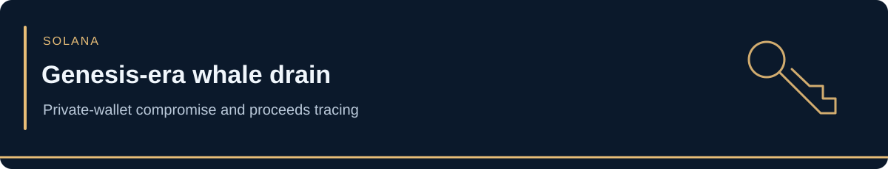

<!-- case-visual:start -->

  

<!-- case-visual:end -->

<!-- doc-nav:start -->

<a href="../../readme.md">Home</a> · <a href="../../wallets.md">Wallet index</a> · <a href="../../CATALOG.md">All case files</a> · <a href="../README.md">Parent index</a>

<!-- doc-nav:end -->

<h1>Genesis-Era Solana Whale Drain</h1>
<!-- contents:start -->

Contents

<ul>
<li><a href="#section-genesis-era-solana-whale-drain">Genesis-Era Solana Whale Drain</a></li>
<li><a href="#section-incident-summary">Incident Summary</a></li>
<li><a href="#section-victim-address--do-not-threat-label">Victim Address — Do Not Threat-Label</a></li>
<li><a href="#section-direct-incident-watch-seeds">Direct Incident-Watch Seeds</a></li>
<li><a href="#section-classification">Classification</a></li>
<li><a href="#section-attribution-limits">Attribution Limits</a></li>
<li><a href="#section-sources">Sources</a></li>
<li><a href="#section-in-other-words">In other words:</a></li>
</ul>

<!-- contents:end -->

<h2>Genesis-Era Solana Whale Drain</h2>

<table>
  <thead>
    <tr><th align="left">Field</th><th align="left">Details</th></tr>
  </thead>
  <tbody>
    <tr><td><strong>Origin chain</strong></td><td>Solana</td></tr>
    <tr><td><strong>Downstream chain</strong></td><td>Ethereum</td></tr>
    <tr><td><strong>Incident</strong></td><td>Suspected compromise and high-value drain of an early Solana wallet tied to the initial Genesis distribution</td></tr>
    <tr><td><strong>Publicly observed window</strong></td><td>July 10–13, 2026</td></tr>
    <tr><td><strong>Source type</strong></td><td>Primary on-chain researcher disclosure by ZachXBT with Specter Investigation; corroborating public reporting</td></tr>
    <tr><td><strong>Incident confidence</strong></td><td>High that the irregular unstaking, transfer, and cross-chain flow occurred; medium-high that the activity represents theft based on primary researcher assessment</td></tr>
    <tr><td><strong>Compromise-vector confidence</strong></td><td>Unknown</td></tr>
    <tr><td><strong>Estimated loss</strong></td><td>Approximately 180,900 SOL, valued near $14.2 million when publicly reported</td></tr>
    <tr><td><strong>Why it matters</strong></td><td>This is a large self-custody wallet drain with a published victim address and five theft-linked addresses across Solana and Ethereum, but no publicly established private-key, seed-phrase, signing-device, protocol, or smart-contract root cause.</td></tr>
  </tbody>
</table>

<h2>Incident Summary</h2>

ZachXBT reported that an early Solana whale tied to the network's initial Genesis distribution appeared to have approximately 180,900 SOL stolen. The incident was first identified through irregular unstaking and bridging activity and was reviewed together with Specter Investigation.

The published trail includes one victim address, two Solana theft-linked addresses, and three Ethereum theft-linked addresses. The movement from Solana into Ethereum makes the downstream investigation multi-chain, but the compromised asset source and victim wallet were on Solana.

No public evidence reviewed for this case establishes how control of the victim wallet was obtained. The report must therefore remain neutral between exposed private keys, seed compromise, malicious signing, compromised software or hardware, coercion, insider access, or another mechanism.

<h2>Victim Address — Do Not Threat-Label</h2>

<a href="https://solscan.io/account/HwtbQBNnLERakdUDuCCLWmUs2oETLFQZeHUWeQdPads"><code>HwtbQBNnLERakdUDuCCLWmUs2oETLFQZeHUWeQdPads</code></a>

<strong>Classification:</strong> Genesis-era Solana victim wallet.

<strong>Recommended use:</strong> Preserve as the source wallet for unstaking, outbound-transfer, and historical-balance reconstruction. Do not classify this address as attacker-controlled merely because unauthorized transactions originated from it.

<h2>Direct Incident-Watch Seeds</h2>

<h3>Solana Theft-Linked Address 1</h3>

<a href="https://solscan.io/account/Ffd1oB2aYM5UzMYUM7TmxULDRQb6KzgrBwmgj9U1C2bE"><code>Ffd1oB2aYM5UzMYUM7TmxULDRQb6KzgrBwmgj9U1C2bE</code></a>

<strong>Recommended use:</strong> Watch directly and expand inbound funding, victim transfers, swaps, consolidation, bridge preparation, and downstream counterparties.

<h3>Solana Theft-Linked Address 2</h3>

<a href="https://solscan.io/account/653pnn5fzF51FfotBwxua55Es4QXxTdaXJLbPczVmswp"><code>653pnn5fzF51FfotBwxua55Es4QXxTdaXJLbPczVmswp</code></a>

<strong>Recommended use:</strong> Watch directly and use for Solana-side graph expansion and bridge-flow reconstruction.

<h3>Ethereum Theft-Linked Address 1</h3>

<a href="https://etherscan.io/address/0xaa5cfa4e96dda0f9aa30f4dc948b542a9b5817c6"><code>0xaa5cfa4e96dda0f9aa30f4dc948b542a9b5817c6</code></a>

<h3>Ethereum Theft-Linked Address 2</h3>

<a href="https://etherscan.io/address/0x536b4ee7507c41143e1b0bd1bf3f2b84be404836"><code>0x536b4ee7507c41143e1b0bd1bf3f2b84be404836</code></a>

<h3>Ethereum Theft-Linked Address 3</h3>

<a href="https://etherscan.io/address/0xbf11bdfbeb9ed137c352c81e45d191cacae6b0cf"><code>0xbf11bdfbeb9ed137c352c81e45d191cacae6b0cf</code></a>

<strong>Recommended use for the Ethereum set:</strong> Watch directly for consolidation, swaps, bridge reuse, exchange deposits, privacy-protocol interactions, and later recovery activity.

<h2>Classification</h2>
<ul>
  <li><strong>Primary classification:</strong> suspected private-wallet compromise / high-value drain</li>
  <li><strong>Protocol exploit:</strong> no evidence identified</li>
  <li><strong>Solana consensus vulnerability:</strong> no evidence identified</li>
  <li><strong>Known compromise vector:</strong> none publicly established</li>
  <li><strong>Direct-watch targets:</strong> two Solana theft-linked addresses and three Ethereum theft-linked addresses published by ZachXBT</li>
  <li><strong>Victim infrastructure:</strong> Genesis-era source wallet; do not threat-label</li>
  <li><strong>Named attacker:</strong> none publicly identified</li>
</ul>

<h2>Attribution Limits</h2>
<ul>
  <li>ZachXBT described the assets as appearing to have been stolen; the report should preserve that qualified wording unless stronger attribution emerges.</li>
  <li>The theft-linked addresses are high-value monitoring seeds, but a published incident link does not prove that every address was directly controlled by the same person.</li>
  <li>Do not infer the compromise method from the age of the wallet or from the fact that assets were unstaked before transfer.</li>
  <li>Do not classify bridges, exchanges, routers, mixers, validators, or ordinary counterparties as attacker-controlled without transaction-level evidence.</li>
</ul>

<h2>Sources</h2>
<ul>
  <li><a href="https://t.me/s/investigations">ZachXBT — Investigations channel, primary disclosure and published victim/theft addresses</a></li>
  <li><a href="https://phemex.com/academy/solana-whale-wallet-loses-14-million">Phemex — corroborating incident summary and cross-chain flow context</a></li>
</ul>

<h2>In other words:</h2>

A wallet that had held a large early Solana allocation suddenly began unstaking and moving roughly 180,900 SOL. Investigators treated the pattern as likely theft and published the source wallet plus five theft-linked destination addresses.

What is known is the money movement. What is not known is how control of the wallet was obtained. That means this should be tracked as a suspected wallet compromise, not described as a Solana protocol hack.

<strong>TLDR:</strong> Approximately 180,900 SOL worth about $14.2 million left a Genesis-era Solana wallet in suspicious activity and moved into a published Solana-to-Ethereum theft cluster; the compromise mechanism remains unknown.

