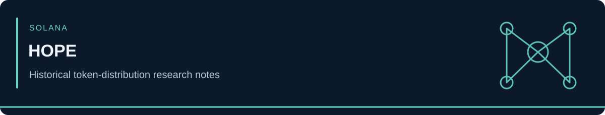

<!-- case-visual:start -->

  

<!-- case-visual:end -->

<!-- doc-nav:start -->

<a href="../../readme.md">Home</a> · <a href="../../wallets.md">Wallet index</a> · <a href="../../CATALOG.md">All case files</a> · <a href="../README.md">Parent index</a>

<!-- doc-nav:end -->

# HOPE Token — Historical Distribution Notes

User Dustyray11 entered the De/Cap Telegram group and promoted HOPE to DeGods and y00ts holders. These historical notes allege that the promoter accumulated approximately 26% of the token supply before the campaign, later retained roughly 10%, and had approximately $25,000 in SharkyFi loans. Treat the wallet relationships below as research leads from the original contributor, not independently verified threat attribution.

- **Main wallet that was used (`26.1%` of 261m tokens)**: `6UWokqQxV4mcK7DeggjQGYMvLJ5HY6zH8AM1Bj6axPGw`
  - Transferred **44,444,444 (`4.4%`)** to: `Cf6hvAoTyqnCCfQzDE9beD3mZwo89MrXSpGb5pUg56Bm` **(sold `1/2` for `$4,500`)**
  - Transferred **54,797,488 (`5.4%`)** to: `AF4MKuiNddkLHP3nFAmQcrJNoSSryDvaRrg6bYhmaTB9` **(holding)**
  - Transferred **25,280,860 (`2.5%`)** to: `8HmSauvV8QWDzeCqh1UeMusE1ni9kHLPcSgMeKyz69N` **(holding)**
  - Transferred **45,175,881 (`4.5%`)** to: `7V2UxVgQJXJNmsb7KBWaTHUVXpTewURkK6csNXYy41Ur` **(sold for `$9,200`)**
  - Transferred **33,333,333 (`3.3%`)** to: `2MSeGgbYc1Y9zDJFYr68A7X5VWS4zuunaFggv5VTxbxi` **(sold for `$2,900`)**

> Solscan: https://solscan.io/account/6UWokqQxV4mcK7DeggjQGYMvLJ5HY6zH8AM1Bj6axPGw
>
> StepFinance: https://app.step.finance/en/history/latest?watching=6UWokqQxV4mcK7DeggjQGYMvLJ5HY6zH8AM1Bj6axPGw
