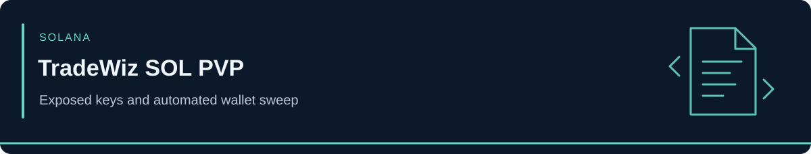

<!-- case-visual:start -->

  

<!-- case-visual:end -->

<!-- doc-nav:start -->

<a href="../../readme.md">Home</a> · <a href="../../wallets.md">Wallet index</a> · <a href="../../CATALOG.md">All case files</a> · <a href="../README.md">Parent index</a>

<!-- doc-nav:end -->

# TradeWiz SOL PVP — Exposed Keys and Automated Wallet Sweep

**Incident:** September 28 test; September 30, 2026 main sweep. **Disclosure:** October 1 Bitquery investigation. **Classification:** product key exposure and wallet theft, not a Solana protocol exploit. **Actor:** unidentified.

TradeWiz acknowledged a limited private-key exposure in its SOL PVP export feature and advised customers to stop using existing addresses. [Bitquery reconstructed](https://bitquery.io/investigations/tradewiz-hack) 20,933 affected wallets and approximately **$459,468** in losses across the operation. Its main sweep emptied 20,776 wallets in roughly 2½ hours; later token transfers and nearly 93,000 token-account closures recovered another 189.31 SOL in rent. The exact key-exfiltration mechanism has not been published.

| Solana address | Role | Treatment |
|---|---|---|
| `6mmiAPpQmY6YFxecmAyHMi2P8B7CE92Y8E65saE388Hj` | Main collector; earlier MEXC withdrawal history | P1 direct watch; historical exchange records are an investigative lead |
| `8Fae1SqAWf4isRk7jkZHYdQeiCYLQQMKBbazdnpaHzcY` | Fee wallet for the second sweep | Direct infrastructure watch |
| `7iFXCZAg9i54N4vNAEPKBaNB7xQc7SbceEQx75fqMHsc` | Proceeds holding wallet; about 1,599 SOL at October 1 snapshot | P1 direct watch; balance is historical |
| `9Jx1rDvCCGLCuyAvuc8MG9bsSE3RdSRajVY85Q54eKCj` | 191 SOL forwarder toward KuCoin | Transaction-linked graph pivot; **ownership unresolved** |

The collector and holding wallet held about 94% of stolen SOL at Bitquery's October 1 snapshot. Two drained customer addresses were drained again within four seconds of receiving new deposits. Compromised customer wallets are victims, not attacker seeds. MEXC and KuCoin infrastructure, TradeWiz fee wallets, and the forwarder's other counterparties do not inherit attacker labels. [addresses.csv](./addresses.csv) distinguishes direct seeds from the ownership-uncertain forwarder.

**Sources:** [Bitquery's transaction-level reconstruction](https://bitquery.io/investigations/tradewiz-hack); [TradeWiz's incident notice](https://x.com/TradeWiz_Bot/status/2105307161907577159).
