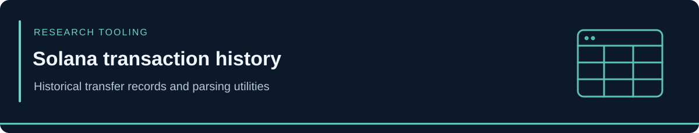

<!-- case-visual:start -->

  

<!-- case-visual:end -->

<!-- doc-nav:start -->

<a href="../../readme.md">Home</a> · <a href="../../wallets.md">Wallet index</a> · <a href="../../CATALOG.md">All case files</a> · <a href="../readme.md">Parent index</a>

<!-- doc-nav:end -->

# Historical Solana Transaction Exports

<!-- contents:start -->

Contents

<ul>
<li><a href="#section-files">Files</a></li>
<li><a href="#section-tools-and-combined-data">Tools and Combined Data</a></li>
</ul>

<!-- contents:end -->

## Files

| Export | Description |
|---|---|
| [x.sol transfers](./x.sol_sol_transfers.csv) | Historical transfer export |
| [x.sol second export](./x.sol_2_sol_transfers.csv) | Separate historical export; may overlap the first |
| [banana.sol transfers](./banana.sol_sol_transfers.csv) | Historical transfer export |

These snapshots are source data, not a current wallet balance or a threat-attribution list. Preserve original timestamps and check transaction identifiers when combining overlapping exports.

## Tools and Combined Data

The scripts reside in the [parent parsing folder](../readme.md), alongside [combined transfers](../combined_sol_transfers.txt) and [combined values](../combined_values.csv). Follow the parent guide to run them from that folder.
